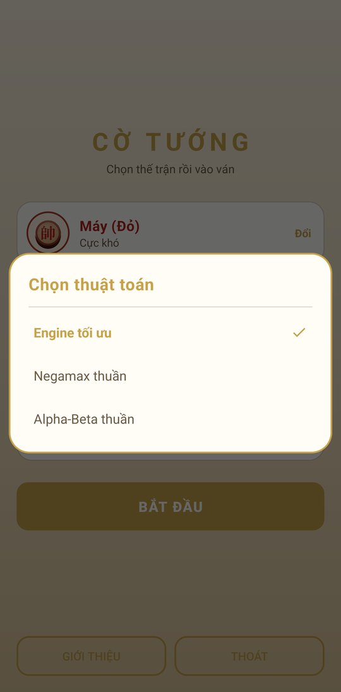
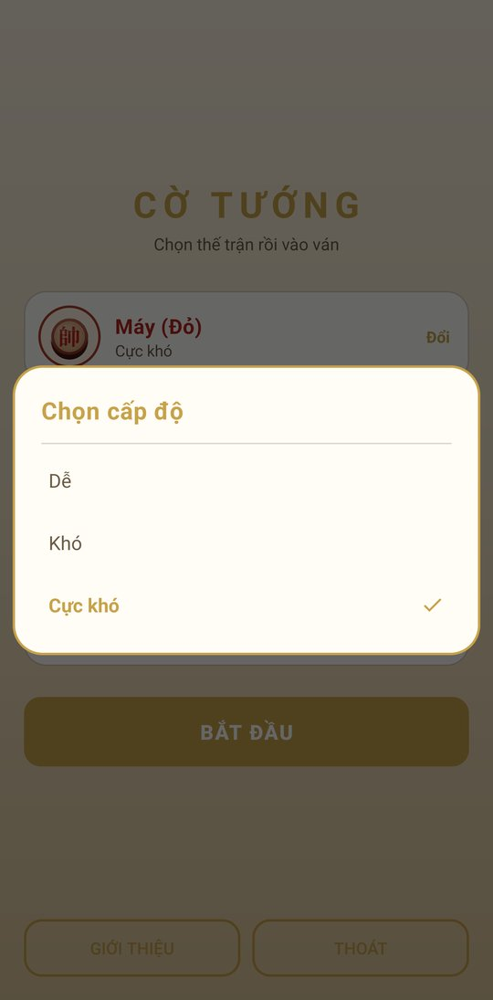
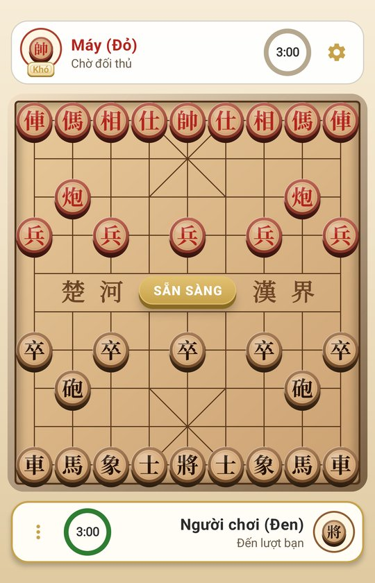
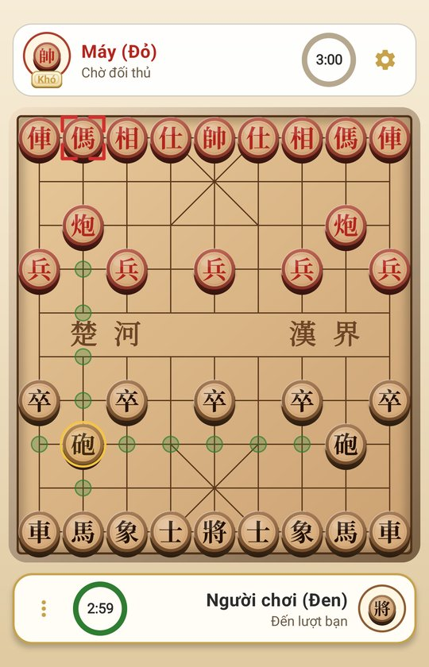
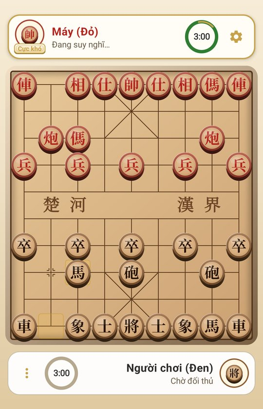
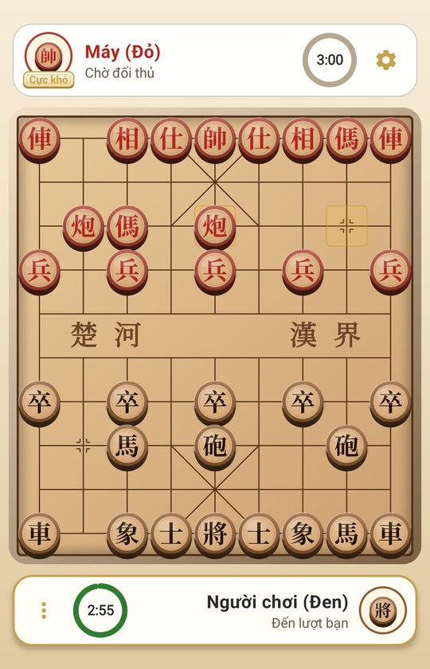
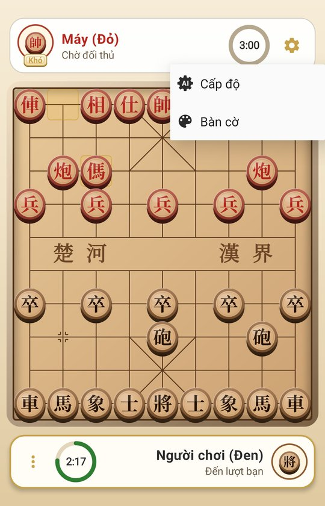
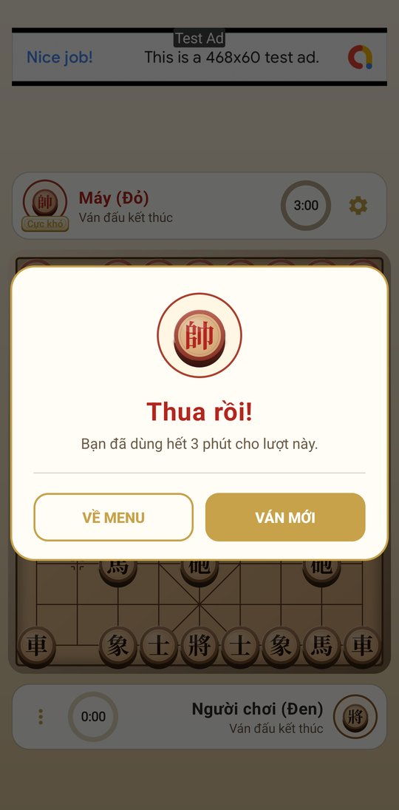

<!-- cover -->
**HỌC VIỆN CÔNG NGHỆ BƯU CHÍNH VIỄN THÔNG**

**KHOA CÔNG NGHỆ THÔNG TIN**

# BÁO CÁO MÔN HỌC: TRÍ TUỆ NHÂN TẠO

**Đề tài: CỜ TƯỚNG AI — NEGAMAX, ALPHA-BETA VÀ ALPHA-BETA CẢI TIẾN**

| | |
|---|---|
| Giảng viên hướng dẫn | [Họ tên giảng viên] |
| Sinh viên thực hiện | [Họ tên sinh viên] |
| Mã sinh viên | [Mã sinh viên] |
| Lớp | [Lớp] — Nhóm [..] |
| Học kỳ | Học kỳ 5 |

*[Địa điểm], tháng 9 năm 2026*
<!-- /cover -->

<!-- toc -->

# LỜI MỞ ĐẦU

Trò chơi đối kháng là một trong những bài toán kinh điển và lâu đời nhất của Trí tuệ nhân tạo. Từ chương trình cờ vua đầu tiên của Alan Turing và Claude Shannon vào những năm 1950 cho tới Deep Blue (1997) và AlphaZero (2017), cờ luôn được xem là "con ruồi giấm" của ngành AI: luật chơi rõ ràng, kết quả đo đếm được, nhưng không gian trạng thái lớn đến mức không thể duyệt hết.

Cờ tướng (Xiangqi) là trò chơi trí tuệ phổ biến bậc nhất ở Việt Nam và Trung Quốc. Về mặt lý thuyết, cờ tướng thuộc lớp trò chơi hai người, tổng bằng không, thông tin đầy đủ và tất định — đúng lớp bài toán mà họ thuật toán **Minimax** và biến thể gọn gàng của nó là **Negamax** được xây dựng để giải.

Báo cáo này trình bày quá trình xây dựng ứng dụng **Cờ Tướng AI** trên nền tảng Android, trong đó trọng tâm là "bộ não" của máy. Thay vì một engine duy nhất, đề tài cài đặt **ba thuật toán** trên **cùng một khung tìm kiếm**, người chơi chọn được thuật toán ngay trong ứng dụng:

1. **Negamax** — duyệt toàn bộ cây trò chơi tới độ sâu cho trước; là "chuẩn đối chiếu" về tính đúng.
2. **Alpha-Beta** (dạng Negamax) — cùng vòng lặp với Negamax, chỉ khác ở **hàm cắt tỉa**; cho kết quả giống hệt nhưng duyệt ít nút hơn hàng trăm lần.
3. **Alpha-Beta cải tiến** (*Enhanced Alpha-Beta*) — Alpha-Beta cộng các kỹ thuật giải quyết những bài toán phát sinh khi đưa thuật toán vào trò chơi thực tế: hiệu ứng đường chân trời, thứ tự nước đi, trạng thái lặp, giới hạn thời gian, cắt tỉa tiến, khoảng cách chiếu hết, luật lặp thế cờ.

Mỗi thuật toán được trình bày theo trình tự: *ý tưởng → giả mã → cài đặt trong chương trình → số liệu đo*. Toàn bộ số liệu trong báo cáo được đo trực tiếp trên mã nguồn hiện tại của đề tài.

Nội dung báo cáo gồm 5 chương:

- **Chương 1 — Tổng quan:** luật cờ tướng và việc mô hình hoá cờ tướng thành một bài toán AI.
- **Chương 2 — Cơ sở lý thuyết:** tìm kiếm đối kháng, Minimax, Negamax, Alpha-Beta và các kỹ thuật cải tiến.
- **Chương 3 — Thiết kế và cài đặt:** kiến trúc, luật chơi, hàm đánh giá, khung tìm kiếm dùng chung và cài đặt chi tiết ba thuật toán.
- **Chương 4 — Thử nghiệm và đánh giá:** số nút duyệt, thời gian, hệ số phân nhánh hiệu dụng, đấu thử giữa các thuật toán.
- **Chương 5 — Kết luận và hướng phát triển.**

# CHƯƠNG 1. TỔNG QUAN ĐỀ TÀI

## 1.1. Giới thiệu trò chơi Cờ Tướng

Cờ tướng được chơi trên bàn cờ gồm **9 cột × 10 hàng giao điểm** (90 vị trí). Giữa bàn cờ là "sông" chia bàn cờ làm hai nửa; mỗi bên có một "cung" kích thước 3×3 giao điểm. Mỗi bên có 16 quân:

| Quân | Số lượng | Cách đi | Ràng buộc đặc biệt |
|---|---|---|---|
| Tướng (帥/將) | 1 | 1 ô theo hàng hoặc cột | Không ra khỏi cung; hai tướng không được đối mặt trên cùng cột mà không có quân cản |
| Sĩ (仕/士) | 2 | 1 ô theo đường chéo | Không ra khỏi cung |
| Tượng (相/象) | 2 | 2 ô theo đường chéo | Không qua sông; bị cản nếu có quân ở "mắt tượng" |
| Mã (馬) | 2 | Hình chữ "nhật" (1 thẳng + 1 chéo) | Bị cản nếu có quân đứng sát ở hướng đi thẳng ("cản chân mã") |
| Xe (車) | 2 | Số ô tuỳ ý theo hàng/cột | Không nhảy qua quân |
| Pháo (炮) | 2 | Như Xe khi di chuyển | Khi ăn quân phải nhảy qua **đúng một** quân làm "ngòi" |
| Tốt (兵/卒) | 5 | 1 ô về phía trước | Sau khi qua sông được đi ngang; không bao giờ đi lùi |

Luật thắng thua quan trọng đối với thiết kế AI:

1. **Chiếu hết** (tướng bị tấn công và không có nước giải) → thua.
2. **Hết nước đi** (không bị chiếu nhưng không còn nước hợp lệ) → cũng tính là **thua**, khác với cờ vua (hoà pat).
3. **Lặp thế cờ:** bên nào liên tục chiếu (trường chiếu) hoặc liên tục đuổi bắt một quân không được bảo vệ (trường bắt) gây ra lặp thế cờ thì bị xử thua; nếu cả hai bên cùng vi phạm hoặc không bên nào vi phạm thì hoà.

## 1.2. Mô hình hoá Cờ Tướng thành bài toán Trí tuệ nhân tạo

Theo cách phân loại môi trường của Russell & Norvig, môi trường cờ tướng có các đặc trưng:

| Đặc trưng | Cờ tướng | Hệ quả đối với thuật toán |
|---|---|---|
| Quan sát được | Đầy đủ (fully observable) | Không cần lưu trạng thái niềm tin; mỗi nút cây là một thế cờ cụ thể |
| Số tác tử | Hai tác tử, đối kháng | Cần tìm kiếm đối kháng (adversarial search) |
| Tính tất định | Tất định (deterministic) | Không có nút "may rủi" (chance node) |
| Tổng lợi ích | Tổng bằng không (zero-sum) | Lợi ích của bên này là thiệt hại của bên kia → nền tảng của **Negamax** |
| Tính tuần tự | Tuần tự, lần lượt | Cây trò chơi xen kẽ hai lớp MAX/MIN |
| Rời rạc / liên tục | Rời rạc | Tập nước đi hữu hạn, liệt kê được |

Tác tử AI trong đề tài là một **tác tử dựa trên lợi ích (utility-based agent)**: tại mỗi lượt, tác tử xây dựng (ngầm) một phần cây trò chơi từ thế cờ hiện tại, ước lượng lợi ích của các thế cờ lá bằng hàm đánh giá, rồi chọn nước đi tối đa hoá lợi ích với giả định đối thủ cũng chơi tối ưu.

## 1.3. Độ phức tạp của bài toán

Hai đại lượng quyết định độ khó của một trò chơi đối với tìm kiếm là **hệ số phân nhánh b** (số nước đi hợp lệ trung bình tại một thế cờ) và **độ sâu d** của ván cờ.

- Đo trực tiếp trên chương trình: thế cờ khai cuộc có **44** nước đi hợp lệ; thế cờ trung cuộc dùng trong Chương 4 (sau 20 nước, còn 30 quân) có **47** nước. Các nghiên cứu thường lấy b ≈ 38 cho cờ tướng (so với ≈ 35 của cờ vua).
- Một ván cờ tướng trung bình kéo dài khoảng 90–100 nước đơn (ply).
- Độ phức tạp không gian trạng thái ước tính cỡ **10^40**, độ phức tạp cây trò chơi cỡ **10^150** (Allis, 1994) — lớn hơn cờ vua (10^123).

Như vậy việc duyệt toàn bộ cây trò chơi là bất khả thi. Chỉ riêng việc nhìn trước 4 nước đơn với Negamax thuần đã phải duyệt khoảng 44^4 ≈ 3,7 triệu nút (số đo thực tế ở Chương 4: **3.371.871** nút). Đây chính là động lực cho cắt tỉa Alpha-Beta và các kỹ thuật cải tiến.

## 1.4. Mục tiêu và phạm vi đề tài

**Mục tiêu:**

- Nghiên cứu cơ sở lý thuyết của tìm kiếm đối kháng: Minimax, Negamax, cắt tỉa Alpha-Beta.
- Cài đặt **ba thuật toán** — Negamax, Alpha-Beta, Alpha-Beta cải tiến — trên **một khung tìm kiếm dùng chung**, tách biệt khỏi luật cờ, theo cùng cách tổ chức mã đã dùng cho các thuật toán tìm kiếm của môn học (bài 33–35: UCS, A\*, tìm kiếm tham lam).
- Phân tích các bài toán phát sinh khi áp dụng Alpha-Beta vào cờ tướng thực tế và các kỹ thuật giải quyết.
- Đo đạc, so sánh ba thuật toán.

**Phạm vi:** Ứng dụng cho người chơi đấu với máy trên một thiết bị (người cầm quân Đen, máy cầm quân Đỏ). Không bao gồm chơi trực tuyến, khai cuộc/tàn cuộc dựng sẵn (opening book, endgame tablebase) và học máy.

**Công cụ:** Java 17, Android SDK (minSdk 24, targetSdk 35), Android Studio, Gradle. Luật cờ (gói `chess`) và phần lõi thuật toán (gói `ai`) viết bằng **Java thuần**, không phụ thuộc Android — biên dịch và chạy được trên JVM thông thường.

# CHƯƠNG 2. CƠ SỞ LÝ THUYẾT

## 2.1. Bài toán tìm kiếm đối kháng

Một trò chơi hai người được hình thức hoá thành bài toán tìm kiếm với các thành phần:

| Thành phần | Ý nghĩa | Trong cờ tướng |
|---|---|---|
| S₀ | Trạng thái ban đầu | Thế cờ khai cuộc |
| PLAYER(s) | Bên có lượt đi tại trạng thái s | Đỏ hoặc Đen |
| ACTIONS(s) | Tập nước đi hợp lệ tại s | Các nước không để tướng mình bị chiếu |
| RESULT(s, a) | Mô hình chuyển trạng thái | Thế cờ sau khi thực hiện nước a |
| TERMINAL-TEST(s) | Kiểm tra trạng thái kết thúc | Bị chiếu hết / hết nước / lặp thế cờ |
| UTILITY(s, p) | Hàm lợi ích tại trạng thái kết thúc | +∞ thắng, −∞ thua, 0 hoà |

Tập hợp các trạng thái sinh ra từ S₀ bằng ACTIONS và RESULT tạo thành **cây trò chơi (game tree)**. Mỗi mức của cây tương ứng với một nước đơn (**ply**) của một bên. Người ta quy ước gọi bên cần tối đa hoá điểm là **MAX**, bên còn lại là **MIN**.

## 2.2. Thuật toán Minimax

### 2.2.1. Ý tưởng

Minimax dựa trên giả định **cả hai bên đều chơi tối ưu**. Giá trị minimax của một nút được định nghĩa đệ quy:

```
            ⎧ UTILITY(s)                                       nếu s là trạng thái kết thúc
MINIMAX(s) = ⎨ max { MINIMAX(RESULT(s,a)) | a ∈ ACTIONS(s) }   nếu PLAYER(s) = MAX
            ⎩ min { MINIMAX(RESULT(s,a)) | a ∈ ACTIONS(s) }   nếu PLAYER(s) = MIN
```

Vì không thể duyệt tới trạng thái kết thúc, trong thực tế ta **giới hạn độ sâu d** và thay UTILITY bằng **hàm đánh giá heuristic** EVAL(s) tại các nút lá (Shannon, 1950).

### 2.2.2. Giả mã

```
function MINIMAX(s, depth, maximizing):
    if depth = 0 or TERMINAL(s):
        return EVAL(s)                      // luôn theo góc nhìn của MAX
    if maximizing:
        best ← −∞
        for each a in ACTIONS(s):
            best ← max(best, MINIMAX(RESULT(s,a), depth − 1, false))
        return best
    else:
        best ← +∞
        for each a in ACTIONS(s):
            best ← min(best, MINIMAX(RESULT(s,a), depth − 1, true))
        return best
```

### 2.2.3. Ví dụ minh hoạ

Xét cây độ sâu 2, hệ số phân nhánh 3 (hình 5.2 trong giáo trình của Russell & Norvig). Gốc A là nút MAX, ba con B, C, D là nút MIN, giá trị lá tính theo góc nhìn của MAX:

```
                        A (MAX) = 3
            ┌─────────────┼─────────────┐
         B (MIN)=3     C (MIN)=2     D (MIN)=2
        ┌───┼───┐     ┌───┼───┐     ┌───┼───┐
        3  12   8     2   4   6    14   5   2
```

MIN chọn giá trị nhỏ nhất ở mỗi nhánh: B = 3, C = 2, D = 2. MAX chọn giá trị lớn nhất: A = 3 → nước đi tốt nhất là nước dẫn tới B.

### 2.2.4. Đánh giá

| Tiêu chí | Minimax |
|---|---|
| Tính đầy đủ | Có (nếu cây hữu hạn) |
| Tính tối ưu | Có, khi đối thủ chơi tối ưu |
| Độ phức tạp thời gian | O(b^d) |
| Độ phức tạp bộ nhớ | O(b·d) (duyệt theo chiều sâu) |

Với b ≈ 40 và d = 8: 40^8 ≈ 6,5 × 10^12 nút — không thể thực hiện trên điện thoại. Minimax thuần chỉ khả thi tới độ sâu 3–4.

## 2.3. Thuật toán Negamax

### 2.3.1. Bài toán đặt ra

Giả mã Minimax có hai nhánh gần như đối xứng cho MAX và MIN. Điều này dẫn tới mã nguồn lặp lại, dễ sai khi bổ sung các kỹ thuật tối ưu (mỗi kỹ thuật phải viết hai lần, một cho MAX và một cho MIN). Negamax khai thác tính chất **tổng bằng không** để hợp nhất hai nhánh làm một.

### 2.3.2. Cơ sở toán học

Trong trò chơi tổng bằng không, lợi ích của bên này bằng đúng âm lợi ích của bên kia:

```
UTILITY(s, MAX) = −UTILITY(s, MIN)
```

Kết hợp với đẳng thức cơ bản:

```
min(a, b) = −max(−a, −b)
```

ta thấy phép lấy min của MIN có thể thay bằng phép lấy max trên các giá trị đã đổi dấu. Negamax định nghĩa giá trị của một nút **theo góc nhìn của bên đang có lượt đi** tại nút đó:

```
NEGAMAX(s) = EVAL_side(s)                                        nếu s là lá
NEGAMAX(s) = max { −NEGAMAX(RESULT(s,a)) | a ∈ ACTIONS(s) }      ngược lại
```

trong đó EVAL_side(s) là điểm của thế cờ s **đối với bên sắp đi** tại s.

**Mệnh đề.** Với mọi nút s: NEGAMAX(s) = MINIMAX(s) nếu PLAYER(s) = MAX, và NEGAMAX(s) = −MINIMAX(s) nếu PLAYER(s) = MIN.

**Chứng minh** (quy nạp theo chiều cao của nút):

- *Nút lá:* EVAL_side(s) bằng EVAL(s) nếu MAX đi, bằng −EVAL(s) nếu MIN đi — đúng theo định nghĩa.
- *Nút MAX:* các con c là nút MIN, theo giả thiết quy nạp NEGAMAX(c) = −MINIMAX(c). Do đó NEGAMAX(s) = max(−NEGAMAX(c)) = max(MINIMAX(c)) = MINIMAX(s).
- *Nút MIN:* các con c là nút MAX nên NEGAMAX(c) = MINIMAX(c). Do đó NEGAMAX(s) = max(−MINIMAX(c)) = −min(MINIMAX(c)) = −MINIMAX(s). ∎

Hệ quả: tại gốc (bên AI có lượt đi), Negamax trả về **đúng** giá trị Minimax và chọn **cùng** một nước đi. Negamax không phải là một thuật toán "khác" mà là cách viết gọn của Minimax — độ phức tạp không đổi, O(b^d).

### 2.3.3. Giả mã

```
function NEGAMAX(s, depth):
    if depth = 0 or TERMINAL(s):
        return EVAL_side(s)                 // theo góc nhìn của bên sắp đi
    best ← −∞
    for each a in ACTIONS(s):
        value ← −NEGAMAX(RESULT(s,a), depth − 1)
        best  ← max(best, value)
    return best
```

Một cách viết tương đương thường gặp trong tài liệu dùng hệ số màu color ∈ {+1, −1}: `return color × EVAL(s)` ở lá và gọi đệ quy với `−color`. Trong đề tài, hàm đánh giá đã trực tiếp trả về điểm theo góc nhìn của bên sắp đi, nên không cần hệ số màu.

### 2.3.4. Ví dụ minh hoạ

Áp dụng Negamax cho cây ở mục 2.2.3. Ở mức lá (sau 2 ply), lượt lại thuộc về MAX nên EVAL_side giữ nguyên giá trị. Tại các nút B, C, D (MIN đi), giá trị con được đổi dấu:

```
NEGAMAX(B) = max(−3, −12, −8) = −3
NEGAMAX(C) = max(−2, −4,  −6) = −2
NEGAMAX(D) = max(−14, −5, −2) = −2
NEGAMAX(A) = max(−(−3), −(−2), −(−2)) = max(3, 2, 2) = 3
```

Kết quả trùng với Minimax: giá trị gốc là 3, nước đi tốt nhất dẫn tới B. Giá trị −3 của B có nghĩa: "với bên đang đi tại B (MIN), thế cờ này là −3", tức là +3 đối với MAX.

### 2.3.5. Ưu điểm và điều kiện áp dụng

**Ưu điểm:**

- Mã nguồn chỉ có **một** hàm đệ quy dùng chung cho cả hai bên, ngắn gọn và dễ bảo trì.
- Mọi kỹ thuật bổ trợ (cắt tỉa, bảng chuyển vị, null-move, tìm kiếm tĩnh...) chỉ cần viết một lần.
- Bảng chuyển vị lưu điểm theo góc nhìn của bên đi — tự nhiên và nhất quán.

**Điều kiện:**

- Trò chơi phải là **tổng bằng không** (hoặc hằng tổng) — cờ tướng thoả mãn.
- Hàm đánh giá phải **đối xứng**: điểm của một thế cờ đối với Đỏ đúng bằng âm điểm của nó đối với Đen. Nếu hàm đánh giá không đối xứng, Negamax sẽ cho kết quả sai.

## 2.4. Cắt tỉa Alpha-Beta dạng Negamax

### 2.4.1. Bài toán đặt ra

Negamax vẫn duyệt toàn bộ b^d nút. Tuy nhiên có những nhánh mà ta **chứng minh được** rằng không thể ảnh hưởng tới quyết định tại gốc; duyệt chúng là lãng phí. Ở ví dụ trên, sau khi biết B = 3, khi duyệt C và gặp lá đầu tiên có giá trị 2, MIN tại C chắc chắn sẽ chọn giá trị ≤ 2 < 3, nên MAX sẽ không bao giờ đi vào C — hai lá còn lại (4 và 6) không cần xét.

### 2.4.2. Ý tưởng

Thuật toán duy trì một **cửa sổ (α, β)**:

- **α** — điểm tốt nhất mà bên đang đi *chắc chắn đạt được* (cận dưới).
- **β** — điểm tối đa mà đối thủ *còn cho phép* bên đang đi đạt được (cận trên); nếu vượt quá β, đối thủ sẽ tránh không đi vào nhánh này từ trước.

Khi một nước đi cho điểm ≥ β, ta **cắt beta (beta cutoff)**: các nước còn lại của nút không cần xét.

Trong dạng Negamax, khi chuyển xuống nút con, góc nhìn đảo ngược nên cửa sổ cũng đảo ngược và đổi dấu: cửa sổ (α, β) của cha trở thành **(−β, −α)** của con. Nhờ vậy, chỉ cần **một** điều kiện cắt `α ≥ β` thay vì hai điều kiện cắt alpha/beta riêng như Minimax.

### 2.4.3. Giả mã

```
function NEGAMAX_AB(s, depth, α, β):
    if depth = 0 or TERMINAL(s):
        return EVAL_side(s)
    best ← −∞
    for each a in ORDER(ACTIONS(s)):          // thứ tự tốt → cắt sớm
        value ← −NEGAMAX_AB(RESULT(s,a), depth − 1, −β, −α)
        if value > best: best ← value
        if best  > α:    α ← best
        if α ≥ β:        break                 // cắt: đối thủ sẽ không cho đi vào đây
    return best

// Lời gọi tại gốc
NEGAMAX_AB(S_current, D, −∞, +∞)
```

So sánh với giả mã NEGAMAX ở mục 2.3.3: hai thuật toán **có cùng vòng lặp**, chỉ khác ở việc Alpha-Beta mang theo cửa sổ (α, β) và dừng vòng lặp khi α ≥ β. Nếu thay điều kiện cắt bằng "không bao giờ cắt", NEGAMAX_AB trở thành đúng NEGAMAX. Chương 3 khai thác trực tiếp nhận xét này: Negamax và Alpha-Beta trong đề tài dùng chung **một** hàm tìm kiếm, chỉ khác ở hàm cắt tỉa truyền vào.

Đây là phiên bản **fail-soft**: giá trị trả về có thể nằm ngoài cửa sổ (α, β) và khi đó mang thông tin về cận:

| Giá trị trả về v | Ý nghĩa |
|---|---|
| v ≤ α ban đầu | *Fail-low*: giá trị thật ≤ v (cận trên) |
| α < v < β | Giá trị chính xác |
| v ≥ β | *Fail-high*: giá trị thật ≥ v (cận dưới) |

Ba trường hợp này được dùng trực tiếp làm cờ đánh dấu khi lưu vào bảng chuyển vị (mục 2.6.3).

### 2.4.4. Ví dụ minh hoạ từng bước

Chạy NEGAMAX_AB trên cây ở mục 2.2.3 (giá trị lá tại nút MIN được nhìn theo góc MIN nên đổi dấu):

| Bước | Nút | Cửa sổ (α, β) | Hành động | Kết quả |
|---|---|---|---|---|
| 1 | B | (−∞, +∞) | Xét lá −3 → α = −3; lá −12, −8 không tốt hơn | B trả về −3 |
| 2 | A | (−∞, +∞) | value = 3 → α_A = 3 | |
| 3 | C | (−∞, −3) | Xét lá −2 → α = −2 ≥ β = −3 → **cắt** | C trả về −2; bỏ qua 2 lá (4, 6) |
| 4 | A | (3, +∞) | value = 2 < 3, giữ nguyên | |
| 5 | D | (−∞, −3) | Lá −14 → α = −14; lá −5 → α = −5; lá −2 → α = −2 ≥ −3 | D trả về −2 (lá cuối, không còn gì để cắt) |
| 6 | A | (3, +∞) | value = 2 < 3 | Gốc = 3, chọn B |

Kết quả giống hệt Minimax nhưng chỉ duyệt 7/9 lá (11 thay vì 13 nút, kể cả gốc và nút trong — đúng như số đo trên chương trình ở mục 3.7.3). Nếu thứ tự các con của D là (2, 14, 5), nhánh D cũng bị cắt ngay sau lá đầu tiên — minh hoạ **thứ tự nước đi quyết định hiệu quả cắt tỉa**.

### 2.4.5. Độ phức tạp

Alpha-Beta **không làm thay đổi kết quả** so với Negamax (tính đúng đắn), chỉ giảm số nút duyệt. Knuth và Moore (1975) chứng minh:

- **Trường hợp xấu nhất** (nước tốt nhất luôn được xét sau cùng): O(b^d) — không cắt được gì.
- **Trường hợp tốt nhất** (nước tốt nhất luôn được xét đầu tiên): số lá phải duyệt là b^⌈d/2⌉ + b^⌊d/2⌋ − 1, tức **O(b^(d/2))**.
- Thứ tự ngẫu nhiên: xấp xỉ O(b^(3d/4)).

Nói cách khác, với thứ tự nước đi tốt, trong cùng thời gian Alpha-Beta có thể **nhìn sâu gấp đôi** Minimax. Với b = 40, d = 8: Minimax cần 40^8 ≈ 6,5 × 10^12 lá, còn Alpha-Beta tối ưu chỉ cần 2 × 40^4 − 1 ≈ 5,1 × 10^6 lá.

## 2.5. Hàm đánh giá tĩnh

Vì không duyệt được tới cuối ván, các thuật toán cần một **hàm đánh giá tĩnh (static evaluation function)** EVAL(s) để ước lượng mức độ thuận lợi của thế cờ lá. Yêu cầu đối với hàm đánh giá:

1. **Tương quan** với xác suất thắng thực sự.
2. **Nhanh**: hàm được gọi tại hầu hết các nút lá — là đoạn mã chạy nhiều nhất của cả chương trình.
3. **Đối xứng** giữa hai bên (điều kiện của Negamax, mục 2.3.5).

Dạng phổ biến là tổ hợp tuyến tính các đặc trưng:

```
EVAL(s) = w₁·f₁(s) + w₂·f₂(s) + ... + wₙ·fₙ(s)
```

trong đó các đặc trưng thường dùng cho cờ tướng là: **giá trị vật chất** (Xe > Pháo ≈ Mã > Tượng ≈ Sĩ > Tốt), **vị trí quân** (bảng điểm theo ô — piece-square table), **an toàn tướng**, **mức độ phát triển quân**. Đề tài sử dụng bảng điểm theo ô gộp cả giá trị vật chất và vị trí, cộng thêm hai thành phần bổ trợ (chi tiết ở mục 3.4). Cả ba thuật toán dùng **chung** một hàm đánh giá, nên chúng chỉ khác nhau ở cách tìm kiếm, không khác ở cách "nhìn" một thế cờ.

## 2.6. Alpha-Beta cải tiến: các bài toán khi áp dụng vào thực tế và kỹ thuật giải quyết

Alpha-Beta thuần tuý vẫn còn nhiều hạn chế khi áp dụng vào một trò chơi thực tế. Mục này trình bày từng bài toán cùng kỹ thuật giải quyết được dùng trong thuật toán **Alpha-Beta cải tiến** của đề tài (cài đặt ở mục 3.8).

### 2.6.1. Hiệu ứng đường chân trời → Tìm kiếm tĩnh (Quiescence Search)

**Bài toán.** Khi dừng tìm kiếm tại độ sâu cố định, thuật toán đánh giá thế cờ ngay cả khi đang giữa một cuộc đổi quân. Ví dụ: ở ply cuối, Xe ăn một Tốt được bảo vệ — hàm đánh giá thấy "được thêm một Tốt", nhưng nước tiếp theo (nằm ngoài "đường chân trời" tìm kiếm) đối phương ăn lại Xe. AI sẽ đánh giá sai hoàn toàn và chủ động đi những nước thí quân vô lý. Đây gọi là **hiệu ứng đường chân trời (horizon effect)**.

**Giải pháp.** Tại nút lá, thay vì đánh giá ngay, ta chạy tiếp một tìm kiếm Negamax thu hẹp chỉ gồm **các nước ăn quân** cho tới khi thế cờ "yên tĩnh" (không còn nước ăn quân đáng kể):

```
function QUIESCE(s, α, β):
    stand ← EVAL_side(s)                 // "đứng yên": bên đi không bắt buộc phải ăn
    if stand ≥ β: return stand
    α ← max(α, stand)
    for each capture c in ORDER_MVV_LVA(CAPTURES(s)):
        if stand + value(victim(c)) + DELTA < α: break     // cắt delta
        value ← −QUIESCE(RESULT(s,c), −β, −α)
        if value ≥ β: return value
        α ← max(α, value)
    return α
```

Giá trị **stand-pat** là cận dưới vì bên đi luôn có quyền không ăn quân. **Cắt delta (delta pruning)**: nếu ngay cả khi ăn được quân đó cộng thêm một biên an toàn vẫn không đạt α thì bỏ qua nước ăn này và các nước sau (vì đã sắp theo giá trị quân bị ăn giảm dần).

### 2.6.2. Thứ tự nước đi → MVV-LVA, nước sát thủ, heuristic lịch sử, nước từ bảng băm

**Bài toán.** Như phân tích ở mục 2.4.5, hiệu quả của Alpha-Beta phụ thuộc hoàn toàn vào việc nước tốt nhất có được xét sớm hay không. Nếu các nước được xét theo thứ tự sinh ra (quét bàn cờ từ trên xuống), Alpha-Beta gần như suy biến về Minimax.

**Giải pháp.** Gán điểm ưu tiên cho từng nước và xét theo thứ tự giảm dần:

| Ưu tiên | Loại nước | Lý do |
|---|---|---|
| 1 | **Nước từ bảng chuyển vị (hash move)** | Nước tốt nhất đã tìm được ở lần duyệt trước của cùng thế cờ |
| 2 | **Nước ăn quân theo MVV-LVA** (*Most Valuable Victim – Least Valuable Attacker*) | Ăn quân giá trị cao bằng quân giá trị thấp trước |
| 3 | **Nước sát thủ (killer moves)** | Nước yên tĩnh (không ăn quân) từng gây cắt beta tại **cùng độ sâu** ở nhánh anh em — rất có thể cũng bác bỏ được nhánh hiện tại |
| 4 | **Heuristic lịch sử (history heuristic)** | Bảng đếm [ô đi][ô đến] cộng (độ sâu còn lại)² mỗi khi nước đó gây cắt tỉa ở bất kỳ đâu trong cây |

Riêng MVV-LVA (ưu tiên 2) là đủ đơn giản để dùng cả cho Alpha-Beta thuần: trong đề tài, Alpha-Beta thuần nhận các nước đã được sắp ăn quân lên trước ngay từ khi sinh (mục 3.7.2).

### 2.6.3. Trạng thái lặp lại (transposition) → Bảng chuyển vị với khoá Zobrist

**Bài toán.** Cùng một thế cờ có thể đạt được bằng nhiều thứ tự nước đi khác nhau (ví dụ: Xe đi trước rồi Mã, hoặc Mã đi trước rồi Xe). Cây trò chơi thực chất là một **đồ thị**, và Negamax thuần sẽ duyệt lại cùng một cây con nhiều lần.

**Giải pháp.** Dùng **bảng chuyển vị (transposition table — TT)**, một bảng băm lưu kết quả đã tính cho từng thế cờ: *khoá, độ sâu đã tìm, điểm, loại cận (EXACT/LOWER/UPPER), nước tốt nhất*. Trước khi duyệt một nút, tra bảng:

- Nếu mục lưu có độ sâu ≥ độ sâu cần tìm và loại cận cho phép (EXACT; hoặc LOWER với điểm ≥ β; hoặc UPPER với điểm ≤ α) → trả về luôn, không duyệt.
- Nếu không dùng được điểm, vẫn lấy **nước tốt nhất** đã lưu để xét đầu tiên (hash move).

Khoá của thế cờ được tính bằng **băm Zobrist** (Zobrist, 1970): sinh trước một số ngẫu nhiên 64-bit cho mỗi cặp (ô, quân) và một số cho lượt đi. Khoá của thế cờ là phép XOR của các số ứng với mọi quân đang có trên bàn. Vì XOR là phép tự nghịch đảo (x ⊕ k ⊕ k = x), việc cập nhật khoá khi đi hoặc lùi một nước chỉ cần 3–4 phép XOR thay vì quét lại 90 ô:

```
key ← key ⊕ Z[from][piece] ⊕ Z[to][piece] ⊕ Z[to][captured] ⊕ Z_side
```

### 2.6.4. Giới hạn thời gian → Tìm kiếm sâu dần (Iterative Deepening)

**Bài toán.** Thời gian tìm kiếm tăng theo hàm mũ với độ sâu và thay đổi mạnh theo từng thế cờ. Nếu cố định độ sâu, có thế cờ máy trả lời tức thì, có thế cờ máy "treo" hàng phút. Nếu đặt giới hạn thời gian cho một lần tìm cố định độ sâu, khi hết giờ giữa chừng ta không có kết quả nào đáng tin.

**Giải pháp.** Lần lượt chạy tìm kiếm với độ sâu 1, 2, 3, ... cho tới khi hết thời gian hoặc đạt độ sâu tối đa; luôn giữ lại kết quả của **lần lặp gần nhất đã hoàn thành**. Chi phí lặp lại các độ sâu nông là nhỏ (tổng chi phí các lần lặp trước chỉ bằng một phần nhỏ lần lặp cuối), và còn được bù lại: nước tốt nhất của lần lặp trước được xét đầu tiên ở lần lặp sau, và bảng chuyển vị/killer/history đã "học" được từ các lần trước — giúp cắt tỉa nhiều hơn hẳn.

### 2.6.5. Cắt tỉa tiến → Null-move Pruning và bài toán Zugzwang

**Bài toán.** Alpha-Beta là cắt tỉa *lùi* (backward pruning) — an toàn tuyệt đối nhưng giới hạn ở O(b^(d/2)). Muốn nhìn sâu hơn cần mạnh dạn bỏ qua các nhánh "gần như chắc chắn" vô ích.

**Giải pháp.** Giả sử bên đi **bỏ lượt** (null move) và tìm kiếm với độ sâu giảm R (R = 2 hoặc 3) bằng một cửa sổ rỗng (β−1, β). Nếu ngay cả khi nhường lượt cho đối thủ mà điểm vẫn ≥ β, thì với một nước đi thực sự điểm càng cao hơn → cắt ngay cả cây con. Lập luận này dựa trên giả định "được đi luôn tốt hơn bỏ lượt".

Giả định đó **sai** trong các thế **zugzwang** — mọi nước đi đều làm thế cờ xấu đi. Vì vậy null-move chỉ được dùng khi: bên đi không bị chiếu (bị chiếu thì không thể bỏ lượt), bên đi còn quân mạnh (Xe/Mã/Pháo — thế chỉ còn Tướng, Sĩ, Tượng, Tốt dễ rơi vào zugzwang), nút đủ sâu để khoản tiết kiệm lớn hơn chi phí thử, và nút không phải là nút vừa bỏ lượt (không bỏ lượt hai lần liên tiếp).

### 2.6.6. Chọn đường chiếu hết ngắn nhất → Điểm chiếu hết theo khoảng cách

**Bài toán.** Nếu mọi thế bị chiếu hết đều có cùng điểm −∞, AI không phân biệt được "chiếu hết sau 2 nước" và "chiếu hết sau 6 nước"; nó có thể lòng vòng mãi không kết thúc ván, hoặc khi thua thì không cố kéo dài.

**Giải pháp.** Điểm của thế bị chiếu hết là **−(WIN − ply)** với ply là khoảng cách tới gốc. Chiếu hết càng sớm, điểm (đối với bên thắng) càng cao. Khi lưu vào bảng chuyển vị, điểm chiếu hết được quy đổi về khoảng cách tính từ chính thế cờ đó (không phải từ gốc), và quy đổi ngược lại khi đọc ra. Cả ba thuật toán của đề tài đều chấm điểm thế thua theo khoảng cách; riêng việc quy đổi khi lưu bảng chỉ cần cho thuật toán cải tiến.

### 2.6.7. Lặp thế cờ, chiếu mãi → Phát hiện lặp trong cây tìm kiếm

**Bài toán.** Negamax giả định cây là hữu hạn và không có chu trình. Trong thực tế, một bên có thể chiếu qua chiếu lại vô hạn; nếu không xử lý, AI có thể đánh giá một chuỗi chiếu vô tận là "thắng", hoặc đi tới đi lui một quân vì không tìm ra nước nào tốt hơn.

**Giải pháp.** Trong quá trình tìm kiếm, lưu khoá Zobrist của các thế cờ trên đường đi hiện tại và của toàn bộ lịch sử ván đấu. Nếu thế cờ hiện tại trùng với một thế đã xuất hiện, gán điểm **0 (hoà)** cho nút đó. Ở cấp độ ván cờ, bộ xử lý luật áp dụng luật trường chiếu / trường bắt để xử thua bên vi phạm.

# CHƯƠNG 3. THIẾT KẾ VÀ CÀI ĐẶT

## 3.1. Kiến trúc tổng thể

### 3.1.1. Các gói và vai trò

Mã nguồn nằm trong gói gốc `com.ttnt.chinesechess`, chia theo tầng:

| Gói | Thành phần chính | Vai trò |
|---|---|---|
| (gốc) | `MenuScreen`, `GameScreen`, `AboutScreen`, `Settings` | Các màn hình (Activity) và phần lưu cài đặt |
| `view` | `GameView`, `TurnTimerView` | Điều phối ván cờ trên màn hình: nhận chạm, gọi AI trên luồng nền, xử lý kết thúc ván; đồng hồ lượt đi |
| `theme` | `Graphics`, `PieceArt`, `BoardTheme` | Vẽ bàn cờ, quân cờ, bảng màu |
| `chess` | `Board`, `Rules`, `Piece` và `CKing`…`CPawn`, `Move`, `MoveRecord`, `PieceCode`, `Point` | **Luật cờ tướng** — Java thuần |
| `ai` | `GameState`, `GameSearch`, `Negamax`, `AlphaBeta` | **Khung tìm kiếm dùng chung** và hai thuật toán thuần — không biết gì về cờ tướng |
| `ai.optimize` | `EnhancedGameSearch`, `EnhancedAlphaBeta`, `OptimizedChessState`, `OptimizedBoard` | **Alpha-Beta cải tiến** |
| `ai.engine` | `Engine`, `Algorithm`, `ChessState`, `Evaluation` | Nối luật cờ với thuật toán: trạng thái cờ cho thuật toán thuần, hàm đánh giá, máy chơi, chọn thuật toán và độ sâu |

Quan hệ phụ thuộc giữa các gói ("A → B" nghĩa là A dùng B):

```
giao diện (MenuScreen, GameScreen, view, theme) → ai.engine, chess
ai.engine   (Engine, Algorithm, ChessState, Evaluation)       → ai, ai.optimize, chess
ai.optimize (EnhancedGameSearch, EnhancedAlphaBeta, ...)      → ai, ai.engine (Evaluation), chess
ai          (GameState, GameSearch, Negamax, AlphaBeta)       → (không phụ thuộc gói nào)
chess       (Board, Rules, Piece, Move, MoveRecord, ...)      → (không phụ thuộc gói nào)
```

Hai gói ở tầng dưới cùng — `chess` và `ai` — **không phụ thuộc gói nào khác** (chỉ dùng thư viện chuẩn `java.util`); đã kiểm tra bằng cách biên dịch riêng từng gói bằng `javac` thông thường, không có thư viện Android. Nhờ đó luật cờ và thuật toán kiểm thử được hoàn toàn trên máy tính (mục 3.10). Trong `ai.engine`, chỉ `Engine` dùng một lớp Android (`android.util.Log`, để ghi nhật ký).

### 3.1.2. Luồng một lượt của máy

1. Người chơi chọn **thuật toán** (Alpha-Beta cải tiến / Negamax / Alpha-Beta) và **cấp độ** ở màn hình chính; lựa chọn được lưu trong `Settings`.
2. Khi mở ván, `GameView` đọc cài đặt và tạo máy chơi: `engine = algorithm.create(board, level)`.
3. Đến lượt máy, `GameView` gọi `engine.generateMove(board.redToMove)` trên một **luồng nền đơn** (`ExecutorService`) để giao diện không bị treo; đồng hồ của máy hiện vòng quay "Đang suy nghĩ…".
4. Kết quả được gửi về luồng giao diện qua `Handler`: thực hiện nước đi, ghi biên bản (`MoveRecord`), kiểm tra thua (`Rules.hasLost`) và lặp thế cờ (`Rules.judgeRepetition`).

Hình ảnh các bước này trên ứng dụng được trình bày ở mục 3.11.

## 3.2. Biểu diễn bàn cờ và nước đi

**Bàn cờ (`Board`)** là mảng hai chiều `byte[10][9]` (`Board.ROW = 10`, `Board.COL = 9`). Mỗi ô chứa **mã quân** định nghĩa trong `PieceCode`:

| Quân | Tướng | Sĩ | Tượng | Mã | Xe | Pháo | Tốt |
|---|---|---|---|---|---|---|---|
| Đen (người chơi) | `BLACK_KING` = 8 | 9 | 10 | 11 | 12 | 13 | `BLACK_PAWN` = 14 |
| Đỏ (máy) | `RED_KING` = 15 | 16 | 17 | 18 | 19 | 20 | `RED_PAWN` = 21 |
| Loại quân (`kind`) | `KING` = 0 | `ADVISOR` = 1 | `ELEPHANT` = 2 | `KNIGHT` = 3 | `ROOK` = 4 | `CANNON` = 5 | `PAWN` = 6 |

Ô trống là `PieceCode.EMPTY = 0`. Hai khối mã liên tiếp và cùng thứ tự cho phép xác định màu quân bằng một phép so sánh và loại quân bằng một phép trừ; mã nguồn không dùng số trần mà gọi qua các hàm có tên:

```java
public static boolean isRed(byte code)               { return code >= RED_KING; }
public static boolean belongsTo(byte code, boolean red) { return code >= BLACK_KING && isRed(code) == red; }
public static int kind(byte code)  { return isRed(code) ? code - RED_KING : code - BLACK_KING; }
public static byte of(int kind, boolean red) { return (byte) ((red ? RED_KING : BLACK_KING) + kind); }
```

Hình học bàn cờ cũng có tên: `Board.inside(x, y)`, `Board.inPalace(x, y, red)` (cung tướng: 3 cột giữa của 3 hàng ở mỗi đầu), `Board.onOwnHalf(x, red)` (sông nằm giữa hàng 4 và 5), `Board.homeRow(red)`. Thế cờ khai cuộc `Board.cellStartup` được dựng từ luật xếp quân (hàng sau, Pháo, Tốt) thay vì một bảng số.

**Ô cờ (`Point`)** là lớp riêng của đề tài gồm hai trường `x` (hàng) và `y` (cột) — thay cho `android.graphics.Point`, để gói `chess` không phụ thuộc Android.

**Nước đi (`Move`)** lưu **ô đi, ô đến, quân đi và quân bị ăn**. Nhờ lưu quân bị ăn, một nước đi có thể được hoàn tác chỉ từ chính nó mà không cần sao chép bàn cờ — điều bắt buộc khi thuật toán thực hiện hàng triệu lần đi/lùi mỗi lượt:

```java
public void play(Move move) {                      // ChessState
    board.cell[move.to.x][move.to.y] = move.piece;
    board.cell[move.from.x][move.from.y] = PieceCode.EMPTY;
    side = !side;  ply++;  version++;
}

public void undo(Move move) {
    board.cell[move.to.x][move.to.y] = move.captured;
    board.cell[move.from.x][move.from.y] = move.piece;
    side = !side;  ply--;  version++;
}
```

**Biên bản ván cờ (`MoveRecord`)**: sau mỗi nước, `Board` ghi một bản ghi gồm **bản chụp 90 ô** sau nước đi, bên vừa đi, nước đó có chiếu hay có đuổi bắt không. Biên bản dùng cho luật lặp thế cờ (mục 3.3) và cho thuật toán cải tiến nhận ra các thế đã có trong ván (mục 3.8.5). Hai thế được coi là giống nhau khi cùng bên đi và cùng từng ô (`Arrays.equals`), nên việc xử lặp không bao giờ nhầm do trùng mã băm.

## 3.3. Luật chơi (`Rules`)

Toàn bộ luật chơi nằm trong lớp `Rules` (các hàm tĩnh nhận `Board`), tách khỏi `Board` chỉ giữ thế cờ:

| Nhóm | Hàm | Ý nghĩa |
|---|---|---|
| Đi quân | `collect(board, side, capturesOnly, legalOnly, out)` | Sinh nước của một bên, theo thứ tự quét bàn cờ (hàng từ trên xuống, cột từ trái sang) |
| | `allMoves`, `hasLegalMove` | Mọi nước hợp lệ; có còn nước hợp lệ nào không (dừng ngay khi tìm thấy nước đầu tiên) |
| | `kingSafe(board, side)` | Tướng của `side` có đang bị tấn công không |
| | `canSelect`, `canMoveTo`, `movesFrom` | Phục vụ giao diện: chọn quân, đi quân, các ô đi được |
| Kết thúc ván | `hasLost(board, side)` | Hết nước hợp lệ là thua (chiếu bí hoặc hết nước) |
| | `givesCheck`, `isChasing` | Nước vừa đi có chiếu / có đuổi bắt quân không được bảo vệ |
| | `judgeRepetition(history)` | Xử luật lặp thế cờ (trường chiếu, trường bắt, hoà) |

**Sinh nước.** Mỗi lớp quân (`CKing`, `CBishop` — Sĩ, `CElephant`, `CKnight`, `CRook`, `CCannon`, `CPawn`) cài đặt `generate()` theo luật riêng (Mã kiểm tra cản chân, Pháo tìm ngòi, Tốt kiểm tra đã qua sông...). Mọi nước đều đi qua một điểm chung `Piece.offer()`, nơi có hai tuỳ chọn phục vụ tìm kiếm: `capturesOnly` — chỉ sinh nước ăn quân (cho tìm kiếm tĩnh); `legalOnly` — chỉ giữ nước không để tướng mình bị chiếu. Khi `legalOnly` tắt, danh sách là **giả hợp lệ (pseudo-legal)** và người gọi phải tự kiểm tra từng nước khi thực sự đi (mục 3.8.7).

**Kiểm tra chiếu nhìn từ tướng (`Rules.kingSafe`).** Thay vì hỏi từng quân địch "có tấn công được tướng không", hàm nhìn ra từ vị trí tướng: 4 tia thẳng phát hiện Xe, Pháo (nhảy qua đúng một ngòi) và luật hai tướng đối mặt; 8 vị trí Mã (có kiểm tra cản chân); 3 vị trí Tốt. Sĩ và Tượng bị bỏ qua vì không bao giờ rời nửa bàn cờ của mình nên không thể tấn công tướng địch. Đây là đoạn mã chạy nhiều nhất của chương trình, vì mọi nước sinh ra đều phải qua phép kiểm tra này.

**Luật lặp thế cờ (`Rules.judgeRepetition`).** Khi thế cờ hiện tại xuất hiện lần thứ ba trong biên bản, hàm xét chu trình giữa hai lần xuất hiện: bên nào **mọi nước** trong chu trình đều chiếu (trường chiếu) hoặc đều đuổi bắt một quân không được bảo vệ (trường bắt) thì bị xử thua; nếu cả hai hoặc không bên nào như vậy thì xử hoà.

## 3.4. Hàm đánh giá (`Evaluation`)

`Evaluation.score(board, side)` trả về điểm theo góc nhìn của `side` — đúng yêu cầu của Negamax. Cả ba thuật toán dùng chung hàm này. Điểm gồm ba thành phần.

**(1) Bảng điểm theo ô (piece-square table).** Mỗi loại quân có một bảng 10×9 cho biết giá trị của quân đó tại từng ô. Giá trị trong bảng đã bao gồm cả giá trị vật chất (Xe ≈ 90, Pháo ≈ 50, Mã ≈ 40, Tượng ≈ 22–28, Sĩ ≈ 19–22, Tốt 0–23) lẫn giá trị vị trí. Ví dụ bảng của quân Xe (nhìn từ phía Đen):

```
{90, 90, 90, 90, 90, 90, 90, 90, 90},
{90, 92, 91, 91, 90, 91, 91, 92, 90},
{90, 91, 90, 90, 90, 90, 90, 91, 90},
{90, 91, 90, 91, 90, 91, 90, 91, 90},
{90, 93, 90, 91, 90, 91, 90, 93, 90},
{90, 94, 90, 94, 90, 94, 90, 94, 90},   // Xe ở bờ sông được cộng điểm
{90, 91, 90, 91, 90, 91, 90, 91, 90},
{90, 92, 90, 91, 90, 91, 90, 92, 90},
{91, 92, 90, 93, 90, 93, 90, 92, 91},
{89, 92, 90, 90, 90, 90, 90, 92, 89}    // Xe nằm ở góc bị trừ điểm
```

Quân Tốt chưa qua sông gần như không có giá trị (0–15), qua sông tăng lên 20–23 và cao nhất khi áp sát cung tướng. Bảng của Đỏ được suy ra bằng cách **lật ngược và đối xứng** bảng của Đen, đảm bảo tính đối xứng của hàm đánh giá. Để tăng tốc, tất cả các bảng được "làm phẳng" một lần khi nạp lớp thành mảng `PIECE_SQUARE[mã quân][ô]` đã mang sẵn dấu (+ cho Đỏ, − cho Đen), nên đánh giá một thế cờ chỉ còn là một vòng lặp cộng qua 90 ô.

**(2) Thưởng tấn công khi đối phương thiếu quân phòng thủ (`attackBonus`).** Bên thiếu Sĩ thì dễ bị Pháo và Mã tấn công; thiếu Tượng thì dễ bị Pháo và Xe tấn công (`GUARDS = 2` là số Sĩ, số Tượng lúc đầu ván):

```
nếu đối phương còn < GUARDS Sĩ:    + 2 × (số Pháo) + (số Mã)
nếu đối phương còn < GUARDS Tượng: + 2 × (số Pháo) + (số Xe)
```

**(3) Phạt Xe chưa phát triển (`development`).** Xe còn nằm ở góc xuất phát và bị Mã của mình chắn: −`UNDEVELOPED_ROOK` (= 5) điểm mỗi Xe.

Công thức tổng: `score(side) = PST(side) + attackBonus(ta) − attackBonus(địch) + development(ta) − development(địch)`. Toàn bộ được tính trong **một lần quét** bàn cờ.

Ngoài ra `Evaluation` cung cấp giá trị quân dùng để **sắp xếp** nước đi (Xe 900, Pháo 450, Mã 400, Tượng 220, Sĩ 200, Tốt 100, Tướng 10000) và bộ so sánh MVV-LVA `BY_CAPTURE` (điểm = 10 × giá trị quân bị ăn − giá trị quân ăn).

## 3.5. Khung tìm kiếm dùng chung

### 3.5.1. Ý tưởng thiết kế

Ba thuật toán của đề tài có chung phần lớn nội dung: đều là Negamax, chỉ khác ở việc có cắt tỉa hay không và có các kỹ thuật bổ trợ hay không. Để thể hiện đúng điều đó trong mã nguồn, đề tài tổ chức phần AI theo **cùng cách** đã dùng cho các thuật toán tìm kiếm trên đồ thị của môn học (bài 33, 34, 35):

| Bài 33–35 (tìm đường trên đồ thị) | Đề tài (tìm kiếm đối kháng) |
|---|---|
| `Problem`: trạng thái đầu, đích, đồ thị, heuristic | `GameState`: trò chơi; `GameSearch.Problem`: trạng thái gốc, độ sâu |
| `Node(state, parent, g, f)` + `solution()` | `GameSearch.Node(action, depth, value, best)` + `bestAction()` |
| `BestFirstSearch.search(problem)` — thuật toán dùng chung | `GameSearch.search(problem)` — thuật toán dùng chung |
| UCS, A\*, Tham lam chỉ khác ở **hàm đánh giá f(n)** truyền vào `Problem`: `(g, h) -> g`, `(g, h) -> g + h`, `(g, h) -> h` | Negamax, Alpha-Beta chỉ khác ở **hàm cắt tỉa** truyền vào `Problem`: `(α, β) -> false`, `(α, β) -> α >= β` |

Nhờ vậy, sự khác biệt giữa Negamax và Alpha-Beta trong mã nguồn đúng bằng sự khác biệt của chúng trong lý thuyết: **một dòng** — hàm cắt tỉa.

### 3.5.2. Giao diện trò chơi `GameState`

`GameState<M>` mô tả một trò chơi hai người, tổng bằng không, thông tin đầy đủ, nhìn từ thế cờ hiện tại (`M` là kiểu nước đi). Thuật toán chỉ hỏi trò chơi 5 câu:

```java
public interface GameState<M> {
    int WIN = 900_000;          // điểm thắng ngay; thế thua được chấm −(WIN − ply)

    List<M> moves();            // các nước hợp lệ của bên đang đi, theo thứ tự sẽ thử
    void play(M move);          // đi nước, trao lượt cho bên kia
    void undo(M move);          // hoàn tác nước vừa đi
    boolean isTerminal();       // ván đã kết thúc tại đây chưa
    int evaluate();             // điểm của thế cờ theo góc nhìn bên đang đi
}
```

Trạng thái được tìm kiếm **tại chỗ**: thuật toán đi một nước, tìm bên dưới, rồi hoàn tác — không bao giờ sao chép thế cờ. `GameState` không biết gì về cờ tướng; lớp `ChessState` (mục 3.6.2) là cài đặt cho cờ tướng.

### 3.5.3. Thuật toán dùng chung `GameSearch`

```java
public final class GameSearch {

    public static final int INF = 1_000_000_000;

    // Ham cat tia, nhan alpha va beta hien tai cua nut
    public interface Cutoff { boolean cut(int alpha, int beta); }

    public static class Problem<M> {
        protected final GameState<M> initial;   // trang thai goc (ben can di)
        protected final int depth;              // do sau toi da (so nuoc nhin truoc)
        protected final Cutoff cutoff;          // ham cat tia cua tung thuat toan
        long visited;                           // so nut da duyet, goc tinh ca vao
        ...
        boolean isLeaf(Node<M> node) { return node.depth >= depth || initial.isTerminal(); }
        List<M> actions()            { return initial.moves(); }
        int eval()                   { return initial.evaluate(); }
    }

    public static class Node<M> {
        public final M action;          // nuoc di tu nut cha den nut nay (goc: null)
        public final int depth;         // so nuoc tu goc
        public int value;               // gia tri negamax, theo goc nhin ben dang di tai nut
        public Node<M> best;            // nut con tot nhat (null o nut la)
        public M bestAction() { return best == null ? null : best.action; }
    }

    public static <M> Node<M> search(Problem<M> problem) {
        problem.visited = 0;
        Node<M> root = new Node<>(null, 0);
        negamax(problem, root, -INF, INF);
        return root;
    }

    private static <M> int negamax(Problem<M> problem, Node<M> node, int alpha, int beta) {
        problem.visited++;
        GameState<M> state = problem.initial;
        if (problem.isLeaf(node)) {
            node.value = problem.eval();
            return node.value;
        }
        int best = -INF;
        for (M a : problem.actions()) {
            Node<M> child = new Node<>(a, node.depth + 1);
            state.play(a);
            int value = -negamax(problem, child, -beta, -alpha);    // doi dau, dao cua so
            state.undo(a);
            if (value > best) {                 // cung gia tri: giu nuoc gap truoc
                best = value;
                node.best = child;
            }
            if (best > alpha) alpha = best;
            if (problem.cutoff.cut(alpha, beta)) break;   // cat tia: bo cac nuoc con lai
        }
        node.value = best;
        return best;
    }
}
```

Hàm `negamax` là cài đặt trực tiếp của giả mã NEGAMAX_AB (mục 2.4.3), với điều kiện cắt được lấy từ `problem.cutoff`. Một số điểm cần lưu ý:

- **Lõi Negamax** thể hiện ở biểu thức `-negamax(problem, child, -beta, -alpha)`: đổi dấu giá trị trả về, đảo và đổi dấu cửa sổ. Không có nhánh riêng cho MAX/MIN; bên đang đi được `GameState` tự theo dõi.
- **Chọn nước tốt nhất:** chỉ khi giá trị *lớn hơn hẳn* mới thay `node.best`, nên khi nhiều nước bằng điểm, nước gặp trước được giữ. Nhờ đó Negamax và Alpha-Beta chọn **cùng một nước** khi cùng thứ tự nước đi (Alpha-Beta chỉ bỏ các nước không thể tốt hơn).
- **Đếm nút:** `visited` tính mọi nút được gọi `negamax`, gồm cả gốc, nút trong và nút lá — dùng cho các phép đo ở Chương 4.
- Cây không được lưu lại: mỗi nút chỉ giữ tham chiếu tới con tốt nhất, nên sau khi tìm xong chỉ còn đường đi chính (principal variation) trong bộ nhớ.

## 3.6. Thuật toán Negamax

### 3.6.1. Cài đặt

Với khung dùng chung, Negamax chỉ là một `Problem` có hàm cắt tỉa **không bao giờ cắt**:

```java
public final class Negamax {
    // ===== Negamax: duyet het cay, khong cat tia =====
    //   negamax(n) = evaluate(n)                       neu n la nut la
    //   negamax(n) = max tren cac con c: -negamax(c)   neu khong
    // cut = false: khong bao gio cat, duyet du b^d nut
    public static final GameSearch.Cutoff CUTOFF = (alpha, beta) -> false;

    public static <M> GameSearch.Problem<M> problem(GameState<M> state, int depth) {
        return new GameSearch.Problem<>(state, depth, CUTOFF);
    }
}
```

Lời gọi theo đúng kiểu của giáo trình: `GameSearch.search(Negamax.problem(state, depth))`. Vì cửa sổ (α, β) vẫn được truyền nhưng không bao giờ dẫn tới cắt, vòng lặp duyệt **đủ mọi nước** ở mọi nút và giá trị trả về luôn là giá trị Negamax chính xác.

### 3.6.2. Trạng thái cờ tướng cho thuật toán thuần: `ChessState`

`ChessState` cài đặt `GameState<Move>` cho cờ tướng, dùng chung cho Negamax và Alpha-Beta. Nó làm việc trên **bản sao** bàn cờ, nên bàn cờ đang hiển thị không bao giờ bị động tới:

```java
public List<Move> moves() {
    ArrayList<Move> moves = new ArrayList<>(48);
    Rules.collect(board, side, false, true, moves);     // nước hợp lệ
    moves.sort(Evaluation.BY_CAPTURE);                  // ăn quân trước (MVV-LVA), sắp ổn định
    return moves;
}

public boolean isTerminal() {                            // hết nước hợp lệ = kết thúc
    if (terminalVersion != version) {
        terminal = !Rules.hasLegalMove(board, side);
        terminalVersion = version;
    }
    return terminal;
}

public int evaluate() {
    if (isTerminal()) return -(MATE - ply);              // thua: càng sớm càng tệ (2.6.6)
    return evaluation.score(board, side);                // theo góc nhìn bên đang đi
}
```

- **Kết thúc ván:** `isTerminal()` hỏi "bên đang đi còn nước hợp lệ không" — trả lời cả hai trường hợp chiếu bí và hết nước, cờ tướng đều xử thua. Kết quả được **nhớ tạm** theo `version` (tăng mỗi lần `play`/`undo`), vì ở nút lá thuật toán hỏi `isTerminal()` rồi `evaluate()` lại hỏi thêm lần nữa.
- **Điểm thua theo khoảng cách:** `ply` đếm số nước từ gốc, nên thế bị chiếu bí ở ply 1 được chấm −899.999 (với bên thua), ở ply 3 là −899.997. Nhìn từ gốc, bên thắng thấy +899.999 và +899.997, nên tự động chọn đường chiếu bí ngắn nhất.
- **Thứ tự nước:** `moves()` sắp nước ăn quân lên trước. Với Negamax điều này không đổi kết quả (mọi nước đều được duyệt), nhưng nó đảm bảo Negamax và Alpha-Beta xét nước theo **cùng một thứ tự**, nên hai thuật toán chọn cùng một nước đi — thuận tiện cho việc đối chiếu.

### 3.6.3. Ví dụ và đặc điểm

Trên cây ở mục 2.2.3, `GameSearch.search(Negamax.problem(...))` trả về giá trị 3, nước B, sau khi duyệt đủ **13 nút** (gốc, 3 nút MIN, 9 lá). Trên cờ tướng, số nút tăng đúng theo b^d: ở thế khai cuộc (b = 44) là 45, 1.965, 81.631, 3.371.871 nút với d = 1..4 (Chương 4).

Negamax thuần **không** phát hiện lặp thế cờ và **không** có tìm kiếm tĩnh — đúng như giả mã giáo trình. Vì chi phí O(b^d), trong ứng dụng Negamax được giới hạn ở độ sâu **2 / 3 / 4** cho ba cấp độ; độ sâu 5 đã cần khoảng 44 lần độ sâu 4, tức cỡ nửa phút mỗi nước trên máy tính.

## 3.7. Thuật toán Alpha-Beta

### 3.7.1. Cài đặt

Alpha-Beta dùng **đúng** vòng lặp `GameSearch.negamax` ở mục 3.5.3; khác biệt duy nhất so với Negamax là hàm cắt tỉa:

```java
public final class AlphaBeta {
    // ===== Alpha-Beta (dang Negamax): cat tia khi alpha >= beta =====
    //   alpha: gia tri ben dang di chac chan dat duoc (tu cac nuoc da xet)
    //   beta : gia tri doi thu chac chan dat duoc o nhanh khac cua cay
    //   Khi alpha >= beta doi thu se khong bao gio cho di vao nut nay -> bo cac nuoc con lai.
    // cut = alpha >= beta
    public static final GameSearch.Cutoff CUTOFF = (alpha, beta) -> alpha >= beta;

    public static <M> GameSearch.Problem<M> problem(GameState<M> state, int depth) {
        return new GameSearch.Problem<>(state, depth, CUTOFF);
    }
}
```

Trong vòng lặp, sau mỗi nước con: `best` là giá trị tốt nhất đã thấy, `alpha` được nâng lên `best`, và khi `alpha >= beta` vòng lặp dừng — các nước còn lại của nút bị bỏ qua. Ở gốc, cửa sổ ban đầu là (−INF, +INF) nên gốc không bao giờ bị cắt và luôn có nước tốt nhất. Hàm trả về `best` (không kẹp vào cửa sổ), tức là phiên bản **fail-soft** (mục 2.4.3).

### 3.7.2. Thứ tự nước đi trong Alpha-Beta thuần

Alpha-Beta thuần dùng chung `ChessState` với Negamax, nên các nước đã được sắp **ăn quân trước, quân bị ăn giá trị cao trước** (MVV-LVA) ngay trong `moves()`. Các nước yên tĩnh (không ăn quân) có cùng điểm 0 và giữ nguyên thứ tự sinh ra nhờ phép sắp xếp ổn định. Đây là cải tiến duy nhất về thứ tự mà Alpha-Beta thuần có; các heuristic thứ tự còn lại (hash move, killer, history) chỉ có trong thuật toán cải tiến. Mục 4.2 đo riêng tác dụng của phép sắp xếp này bằng một biến thể không sắp xếp.

### 3.7.3. Ví dụ: vết chạy trên cây giáo trình

Chạy `GameSearch.search(AlphaBeta.problem(...))` trên cây ở mục 2.2.3, ghi lại mỗi nút khi duyệt xong (giá trị theo góc nhìn bên đi tại nút đó):

| Nút | Độ sâu | Cửa sổ khi vào (α, β) | Giá trị | Ghi chú |
|---|---|---|---|---|
| b1 | 2 | (−∞, +∞) | 3 | |
| b2 | 2 | (−∞, 3) | 12 | |
| b3 | 2 | (−∞, 3) | 8 | |
| B | 1 | (−∞, +∞) | −3 | |
| c1 | 2 | (3, +∞) | 2 | |
| C | 1 | (−∞, −3) | −2 | **cắt**: α = −2 ≥ β = −3, bỏ c2, c3 |
| d1 | 2 | (3, +∞) | 14 | |
| d2 | 2 | (3, 14) | 5 | |
| d3 | 2 | (3, 5) | 2 | |
| D | 1 | (−∞, −3) | −2 | |
| A (gốc) | 0 | (−∞, +∞) | 3 | nước tốt nhất: B |

Kết quả: giá trị 3, nước B — giống Negamax — sau **11 nút** thay vì 13. Trên cờ tướng, ở độ sâu 4 tại thế khai cuộc, Alpha-Beta duyệt 26.289 nút so với 3.371.871 nút của Negamax (ít hơn 128 lần) và trả về **cùng** giá trị gốc ở mọi độ sâu (Chương 4).

### 3.7.4. Đặc điểm trong ứng dụng

Giống Negamax, Alpha-Beta thuần không có tìm kiếm tĩnh, bảng chuyển vị hay phát hiện lặp — nó là "Alpha-Beta của giáo trình". Nhờ cắt tỉa, nó nhìn sâu hơn Negamax 2 ply với cùng thời gian: độ sâu **4 / 5 / 6** cho ba cấp độ.

## 3.8. Thuật toán Alpha-Beta cải tiến

### 3.8.1. Tổng quan và cấu trúc lớp

Alpha-Beta cải tiến vẫn là Negamax với hàm cắt tỉa của Alpha-Beta, nhưng bổ sung các kỹ thuật ở mục 2.6 tại **từng bước** của vòng lặp. Các lớp trong gói `ai.optimize` được tổ chức song song với gói `ai`:

| Gói `ai` (thuần) | Gói `ai.optimize` (cải tiến) | Vai trò |
|---|---|---|
| `GameState` | `OptimizedChessState` | Trạng thái mà thuật toán duyệt |
| `GameSearch` | `EnhancedGameSearch` | Thuật toán: `search(problem)` |
| `AlphaBeta.problem(...)` | `EnhancedAlphaBeta.problem(...)` | Tạo bài toán để đưa vào thuật toán |
| — | `OptimizedBoard` | Bàn cờ có hỗ trợ tìm kiếm (khoá Zobrist, đường lặp, bỏ lượt) |

Quan hệ kế thừa:

```
GameSearch.Problem<Move>         trạng thái gốc, độ sâu, hàm cắt tỉa
        ▲
EnhancedGameSearch               + thuật toán cải tiến; hàm cắt = AlphaBeta.CUTOFF
        ▲
EnhancedAlphaBeta                + problem(board, side, depth, budgetMs); giữ bảng chuyển vị
```

Cách gọi đối xứng với thuật toán thuần:

```java
GameSearch.search(AlphaBeta.problem(state, depth))                                   // thuần
EnhancedGameSearch.search(EnhancedAlphaBeta.problem(board, side, depth, budgetMs))   // cải tiến
```

`EnhancedGameSearch` kế thừa `GameSearch.Problem` và truyền **chính** `AlphaBeta.CUTOFF` làm hàm cắt tỉa — thuật toán cải tiến dùng lại đúng điều kiện cắt của Alpha-Beta. Nó có vòng lặp riêng (không dùng `GameSearch.negamax`) vì cần các điểm can thiệp mà vòng lặp giáo trình không có; nhờ đó `GameSearch` được giữ nguyên đúng như giáo trình.

**`OptimizedBoard`** kế thừa `Board` và cập nhật dần, sau mỗi nước đi/hoàn tác: khoá Zobrist của thế cờ, số Xe/Mã/Pháo của mỗi bên, và đường đi các khoá từ gốc (để phát hiện lặp). **`OptimizedChessState`** cài đặt `GameState<Move>` trên `OptimizedBoard`, đếm `ply` từ gốc, chấm điểm và trả lời thêm các câu hỏi mà thuật toán cải tiến cần: `key()`, `staticEval()`, `captures()`, `pseudoMoves()`, `lastMoveLegal()`, `repeated()`, `canPass()`, `pass()`/`unpass()`.

### 3.8.2. Vòng lặp chính và các điểm can thiệp

```java
private int negamax(GameSearch.Node<Move> node, int alpha, int beta) {
    Integer known = known(node, alpha, beta);          // (1) biết trước giá trị?
    if (known != null) { node.value = known; return known; }
    if (isLeaf(node)) {                                 // (2) nút lá?
        node.value = leafValue(node, alpha, beta);      //     → tìm kiếm tĩnh
        return node.value;
    }
    OptimizedChessState state = position;
    int alpha0 = alpha;
    int best = -GameSearch.INF;
    for (Move a : actions(node)) {                      // (3) nước đi đã sắp thứ tự
        state.play(a);
        if (!legal()) { state.undo(a); continue; }      // (4) kiểm tra hợp lệ muộn
        GameSearch.Node<Move> child = new GameSearch.Node<>(a, node.depth + 1);
        int value = -negamax(child, -beta, -alpha);
        state.undo(a);
        if (value > best) { best = value; node.best = child; }
        if (best > alpha) alpha = best;
        if (cutoff.cut(alpha, beta)) {                  // hàm cắt của AlphaBeta
            cutoffBy(node, a);                          // (5) ghi killer / history
            break;
        }
    }
    node.value = best;
    searched(node, alpha0, beta);                       // (6) lưu bảng chuyển vị
    return best;
}
```

So với `GameSearch.negamax` (mục 3.5.3), phần khung — đổi dấu, đảo cửa sổ, chọn nước tốt nhất, điều kiện cắt — **giữ nguyên**; sáu điểm đánh số là nơi các kỹ thuật cải tiến được gắn vào:

| Điểm | Hàm | Kỹ thuật (mục lý thuyết) |
|---|---|---|
| (1) | `known` | Hết giờ; lặp thế cờ → hoà (2.6.7); tra bảng chuyển vị (2.6.3); null-move (2.6.5) |
| (2) | `isLeaf`, `leafValue` | Độ sâu còn lại có tính phần giảm của null-move; tìm kiếm tĩnh ở lá (2.6.1) |
| (3) | `actions` | Sắp xếp nước: hash move, MVV-LVA, killer, history (2.6.2) |
| (4) | `legal` | Sinh nước giả hợp lệ, chỉ kiểm tra nước thực sự đi |
| (5) | `cutoffBy` | Ghi nước sát thủ và bảng lịch sử |
| (6) | `searched` | Lưu kết quả vào bảng chuyển vị (EXACT/LOWER/UPPER) |

Các mục tiếp theo trình bày từng điểm.

### 3.8.3. Tìm kiếm sâu dần và quản lý thời gian

```java
private GameSearch.Node<Move> deepen() {
    deadline = System.currentTimeMillis() + budgetMs;
    long started = System.currentTimeMillis();
    GameSearch.Node<Move> result = new GameSearch.Node<>(null, 0);
    rootMoves = new ArrayList<>(position.moves());          // nước hợp lệ tại gốc
    if (rootMoves.isEmpty()) { result.value = -WIN; return result; }
    rootMoves.sort(Evaluation.BY_CAPTURE);
    result.best = new GameSearch.Node<>(rootMoves.get(0), 1);   // luôn có nước để đi

    for (int d = 1; d <= depth; d++) {
        if (d > 1 && !worthDeepening(started)) break;
        aborted = false;
        limit = d;
        GameSearch.Node<Move> root = new GameSearch.Node<>(null, 0);
        negamax(root, -GameSearch.INF, GameSearch.INF);
        if (aborted) break;                                 // lần lặp dở dang → bỏ
        result = root;
        reached = d;
        Move found = root.bestAction();
        rootMoves.remove(found);
        rootMoves.add(0, found);                            // nước tốt nhất xét đầu ở lần sau
    }
    return result;
}
```

- `depth` là độ sâu tối đa (thừa kế từ `Problem`), `limit` là độ sâu của lần lặp đang chạy.
- **Kiểm tra thời gian** (`outOfTime`) chỉ đọc đồng hồ mỗi 256 nút (`CLOCK_CHECK_MASK = 255`) để giảm chi phí. Khi hết giờ, cờ `aborted` được bật, mọi nút sau đó trả về ngay, và toàn bộ lần lặp dở dang bị loại — nước đi được chọn luôn đến từ một lần lặp **đã hoàn thành**.
- **Quyết định có đào sâu thêm không** (`worthDeepening`): một ply mới tốn nhiều lần tổng thời gian đã dùng, nên chỉ bắt đầu ply mới khi thời gian đã dùng **< 1/8 ngân sách** (`DEEPEN_FRACTION = 8`). Bắt đầu một ply rồi bỏ dở là lãng phí toàn bộ thời gian còn lại.

### 3.8.4. Trước khi duyệt một nút: `known`

Mã trích lược (bỏ các kiểm tra biên mảng):

```java
private Integer known(GameSearch.Node<Move> node, int alpha, int beta) {
    nodes++;
    int ply = node.depth;
    reduced[ply] = ply == 0 ? 0 : reduced[ply - 1] + pendingReduction;   // phần giảm do null-move
    pendingReduction = 0;
    if (outOfTime()) return 0;
    if (ply == 0) return null;                         // gốc luôn phải duyệt
    if (position.repeated()) return 0;                 // lặp thế cờ → hoà
    int remaining = remaining(node);
    if (remaining <= 0) return null;                   // lá: để tìm kiếm tĩnh xử lý
    Integer stored = probe(ply, remaining, alpha, beta);
    if (stored != null) return stored;                 // bảng chuyển vị đã có câu trả lời

    // Null move
    if (remaining >= NULL_MOVE_MIN_DEPTH && node.action != null && position.canPass()) {
        int reduction = remaining > NULL_MOVE_DEEP ? NULL_MOVE_DEEP_REDUCTION : NULL_MOVE_REDUCTION;
        position.pass();
        pendingReduction = reduction;
        int value = -negamax(new GameSearch.Node<>(null, ply + 1), -beta, -beta + 1);
        position.unpass();
        if (value >= beta && !aborted) return value >= WIN_BOUND ? beta : value;
    }
    return null;
}
```

**Lặp thế cờ.** `OptimizedBoard.repeated(ply)` so khoá hiện tại với các khoá cùng lượt đi trên đường đi từ gốc (bước nhảy 2 ply) và với khoá của mọi thế đã có trong ván. Trùng thì nút được chấm 0 (hoà): AI không coi một chuỗi chiếu vô tận là thắng, và không đi tới đi lui vô ích.

**Bảng chuyển vị** (`probe`): tra ô `key & (TT_SIZE − 1)`; nếu khoá khớp thì lấy nước tốt nhất đã lưu làm hash move cho nút này (`wanted[ply]`), và nếu độ sâu đã lưu ≥ độ sâu còn lại cùng loại cận phù hợp thì trả về luôn điểm đã lưu (mục 2.6.3).

**Null-move.** Điều kiện áp dụng: còn ít nhất 3 ply (`NULL_MOVE_MIN_DEPTH`); nút không phải là nút vừa bỏ lượt (nút bỏ lượt có `action == null`, nên không bỏ lượt hai lần liên tiếp); và `canPass()` — bên đi không bị chiếu và còn ít nhất một Xe/Mã/Pháo (tránh zugzwang). Nước bỏ lượt được tìm bằng **chính vòng lặp `negamax`** với cửa sổ rỗng (−β, −β+1) và độ sâu giảm R = 2 (R = 3 khi còn trên 6 ply).

Vì vòng lặp đo độ sâu bằng khoảng cách tới gốc (`node.depth`), phần giảm của null-move được ghi riêng: `pendingReduction` mang R xuống nút con, và mảng `reduced[ply]` cộng dồn phần giảm trên đường đi, nên:

```java
private int remaining(GameSearch.Node<Move> node) {
    int ply = node.depth;
    return limit - ply - reduced[ply];                 // độ sâu còn lại thật sự
}
```

Nếu kết quả khi bỏ lượt vẫn ≥ β, nút bị cắt ngay. Riêng khi kết quả là điểm chiếu hết, hàm chỉ trả về β (cắt theo cận là đúng, nhưng "chiếu hết sau một nước không ai được đi" không phải chiếu hết thật).

### 3.8.5. Bảng chuyển vị và khoá Zobrist

**Khoá Zobrist** nằm trong `OptimizedBoard`: bảng số ngẫu nhiên 64-bit `ZOBRIST[90 ô][22 mã quân]` và `ZOBRIST_SIDE` (seed cố định để mọi lần chạy băm giống nhau, dễ tái hiện lỗi). Khoá được tính đầy đủ một lần khi dựng bàn cờ, sau đó cập nhật bằng XOR:

```java
private void toggle(Move move) {                      // gọi khi đi và cả khi hoàn tác
    int from = move.from.x * COL + move.from.y;
    int to = move.to.x * COL + move.to.y;
    key ^= ZOBRIST[from][move.piece];
    key ^= ZOBRIST[to][move.piece];
    if (move.captured != PieceCode.EMPTY) key ^= ZOBRIST[to][move.captured];
    key ^= ZOBRIST_SIDE;
    redToMove = !redToMove;
}
```

Khoá của các thế đã có trong ván được tính một lần từ biên bản (`MoveRecord`) khi bắt đầu tìm kiếm — với ván 200 nước chỉ tốn dưới 1 ms.

**Bảng** gồm 2^17 = 131.072 ô, lưu dưới dạng 5 mảng song song (khoá, điểm, nước, độ sâu, cờ) để không phải tạo đối tượng. Bảng nằm trong lớp `Memory`; `EnhancedAlphaBeta` giữ **một** `Memory` dùng chung cho cả ứng dụng, nên bảng được giữ qua các nước và các ván. Việc dùng chung là an toàn vì mọi lần tìm kiếm đều chạy trên cùng một luồng nền, không bao giờ có hai lần tìm cùng ghi vào bảng.

**Điểm chiếu hết trong bảng** được quy đổi: khi lưu, điểm chiếu hết được đổi sang khoảng cách tính từ chính thế cờ (`toTT`), khi đọc thì đổi ngược lại theo ply hiện tại (`fromTT`). Nhờ vậy một mục được dùng lại ở độ sâu khác vẫn cho đúng khoảng cách chiếu hết.

### 3.8.6. Sắp xếp nước đi: `actions`

Tại gốc, danh sách nước của lần lặp trước được dùng lại (nước tốt nhất lên đầu). Ở các nút khác, mỗi nước được chấm điểm rồi sắp xếp giảm dần bằng sắp xếp chèn (ổn định — nước cùng điểm giữ thứ tự sinh):

```java
private int moveScore(Move move, int wanted, int ply) {
    int c = code(move);                                  // from << 8 | to
    if (c == wanted) return HASH_MOVE_SCORE;             // 2^26: nước từ bảng chuyển vị
    if (move.captured != PieceCode.EMPTY) {              // 2^22 + MVV-LVA
        return CAPTURE_SCORE + Evaluation.pieceValue(move.captured) * VICTIM_WEIGHT
                - Evaluation.pieceValue(move.piece);
    }
    if (c == killers[ply][0]) return KILLER_SCORE + 1;   // 2^21 + 1: sát thủ thứ nhất
    if (c == killers[ply][1]) return KILLER_SCORE;       // 2^21: sát thủ thứ hai
    return history[c >> SQUARE_BITS][c & SQUARE_MASK];   // < 2^20: bảng lịch sử
}
```

Các bậc điểm là lũy thừa của 2 cách xa nhau nên các nhóm không bao giờ lẫn vào nhau: mọi nước ăn quân xếp sau hash move và trước mọi nước sát thủ; điểm lịch sử bị chặn ở `HISTORY_CAP = 2^20`. Một nước được mã hoá thành một số nguyên `from << 8 | to` (mỗi ô 0–89 vừa trong 8 bit) để so sánh và làm chỉ số bảng lịch sử `[90][90]`.

### 3.8.7. Sinh nước giả hợp lệ: `legal`

Ở các nút trong, `actions` lấy nước từ `pseudoMoves()` — **không** kiểm tra tướng mình có bị chiếu sau nước đó. Việc kiểm tra chỉ diễn ra khi nước thực sự được đi:

```java
private boolean legal() {
    return position.ply() == 1 || position.lastMoveLegal();   // nước ở gốc đã hợp lệ sẵn
}
```

`lastMoveLegal()` gọi `Rules.kingSafe` cho bên vừa đi. Vì Alpha-Beta với thứ tự tốt thường cắt sau 1–2 nước đầu, phần lớn các nước còn lại không bao giờ được đi và không phải kiểm tra — trong khi kiểm tra chiếu là thao tác tốn kém nhất của việc sinh nước. Nút không có nước hợp lệ nào vẫn được nhận ra đúng vì `isLeaf` đã hỏi `isTerminal()` (còn nước hợp lệ không) trước khi vào vòng lặp.

### 3.8.8. Nút lá: tìm kiếm tĩnh

```java
private int leafValue(GameSearch.Node<Move> node, int alpha, int beta) {
    if (remaining(node) > 0) return position.evaluate();   // chưa hết độ sâu → ván đã kết thúc
    return quiesce(alpha, beta);
}

private int quiesce(int alpha, int beta) {
    nodes++;
    if (outOfTime()) return 0;
    OptimizedChessState state = position;
    int stand = state.staticEval();                         // stand-pat
    if (stand >= beta) return stand;
    if (stand > alpha) alpha = stand;
    if (state.ply() >= depth + QUIET_PLIES) return stand;   // tối đa 4 ply ăn quân thêm
    if (state.isTerminal()) return -(WIN - state.ply());

    List<Move> moves = state.captures();                    // chỉ nước ăn quân, hợp lệ
    moves.sort(Evaluation.BY_CAPTURE);                      // MVV-LVA
    int best = stand;
    for (Move m : moves) {
        if (stand + Evaluation.evalValue(m.captured) + DELTA < alpha) break;   // cắt delta
        state.play(m);
        int value = -quiesce(-beta, -alpha);                // vẫn là Negamax
        state.undo(m);
        if (value > best) best = value;
        if (best > alpha) alpha = best;
        if (alpha >= beta) break;
    }
    return best;
}
```

Tìm kiếm tĩnh cũng là Negamax với cửa sổ Alpha-Beta, chỉ khác ở tập nước (chỉ ăn quân) và việc dùng stand-pat làm cận dưới. Độ sâu mở rộng bị giới hạn bởi `QUIET_PLIES = 4` để tránh bùng nổ trong những thế có chuỗi ăn quân dài; biên an toàn của cắt delta là `DELTA = 25` (đơn vị của hàm đánh giá, xấp xỉ giá trị một Tượng).

### 3.8.9. Khi quay lui: `cutoffBy` và `searched`

**`cutoffBy`** — khi một nước **yên tĩnh** gây cắt: đưa nó vào vị trí sát thủ thứ nhất của ply đó (sát thủ cũ lùi xuống vị trí thứ hai), và cộng (độ sâu còn lại)² vào bảng lịch sử — cắt ở nút càng sâu phía trên càng có trọng số lớn. Nước ăn quân không cần ghi vì đã được MVV-LVA xếp trước.

**`searched`** — lưu kết quả của nút vào bảng chuyển vị, trừ khi lần lặp đã bị bỏ dở do hết giờ. Loại cận được suy từ giá trị so với cửa sổ ban đầu (fail-soft, mục 2.4.3): `best ≤ α₀` → UPPER, `best ≥ β` → LOWER, còn lại → EXACT. Chính sách thay thế: không ghi đè một mục của **cùng** thế cờ đã được tìm sâu hơn.

### 3.8.10. So sánh ba thuật toán trong mã nguồn

| Đặc điểm | Negamax | Alpha-Beta | Alpha-Beta cải tiến |
|---|---|---|---|
| Vòng lặp | `GameSearch.negamax` | `GameSearch.negamax` | Vòng lặp riêng, cùng khung |
| Hàm cắt tỉa | `(α, β) -> false` | `(α, β) -> α >= β` | `AlphaBeta.CUTOFF` |
| Trạng thái | `ChessState` | `ChessState` | `OptimizedChessState` + `OptimizedBoard` |
| Thứ tự nước | MVV-LVA (không ảnh hưởng kết quả) | MVV-LVA | Hash move, MVV-LVA, killer, history |
| Nước giả hợp lệ | Không | Không | Có |
| Nút lá | Hàm đánh giá | Hàm đánh giá | Tìm kiếm tĩnh + cắt delta |
| Bảng chuyển vị | Không | Không | Có (Zobrist, 2^17 ô) |
| Null-move | Không | Không | Có |
| Phát hiện lặp trong cây | Không | Không | Có |
| Tìm kiếm sâu dần, giới hạn thời gian | Không (độ sâu cố định) | Không (độ sâu cố định) | Có |
| Điểm thua theo khoảng cách | Có | Có | Có (+ quy đổi trong bảng) |

Đề tài **không** dùng kỹ thuật PVS/NegaScout (tìm các nước sau nước đầu bằng cửa sổ rỗng rồi tìm lại khi cần). PVS thay đổi chính cách vòng lặp gọi xuống nút con, trong khi thiết kế ở đây giữ nguyên vòng lặp của Alpha-Beta và chỉ gắn kỹ thuật vào các điểm can thiệp. PVS được đưa vào hướng phát triển (Chương 5).

## 3.9. Máy chơi, cấp độ và lựa chọn thuật toán

**`Engine`** là lớp duy nhất mà giao diện dùng để hỏi nước đi. Ba hàm tạo ứng với ba thuật toán; mỗi hàm truyền vào một hàm tìm kiếm (lambda) nhận "bên nào đi" và trả về kết quả:

```java
public static Engine negamax(Board board, int depth) {
    return new Engine("Negamax", depth, red ->
            run(Negamax.problem(new ChessState(board, red), depth), depth));
}

public static Engine alphaBeta(Board board, int depth) {
    return new Engine("Alpha-Beta", depth, red ->
            run(AlphaBeta.problem(new ChessState(board, red), depth), depth));
}

public static Engine optimized(Board board, int depth, long budgetMs) {
    return new Engine("Optimized", depth, red -> {
        EnhancedAlphaBeta problem = EnhancedAlphaBeta.problem(board, red, depth, budgetMs);
        GameSearch.Node<Move> root = EnhancedGameSearch.search(problem);
        return new Result(root.bestAction(), root.value, problem.reached(), problem.visited());
    });
}

private static Result run(GameSearch.Problem<Move> problem, int depth) {   // kiểu giáo trình
    GameSearch.Node<Move> root = GameSearch.search(problem);
    return new Result(root.bestAction(), root.value, depth, problem.visited());
}
```

`engine.generateMove(side)` gọi hàm tìm kiếm, ghi nhật ký (thuật toán, độ sâu đạt/độ sâu tối đa, điểm, số nút, thời gian) và trả về nước đi.

**`Algorithm`** ánh xạ lựa chọn trong màn hình chính và cấp độ (`level` = 2, 3, 4 cho Dễ, Khó, Cực khó) sang máy chơi:

```java
public Engine create(Board board, int level) {
    int lv = Math.max(1, level);
    return switch (this) {
        case OPTIMIZED  -> Engine.optimized(board, lv * 2, budget(lv));
        case NEGAMAX    -> Engine.negamax(board, lv);
        case ALPHA_BETA -> Engine.alphaBeta(board, lv + 2);
    };
}
```

| Cấp độ | `level` | Negamax (ply) | Alpha-Beta (ply) | Alpha-Beta cải tiến (ply / ngân sách) |
|---|---|---|---|---|
| Dễ | 2 | 2 | 4 | 4 / 1,5 giây |
| Khó | 3 | 3 | 5 | 6 / 6 giây |
| Cực khó | 4 | 4 | 6 | 8 / 24 giây |

Độ sâu của mỗi thuật toán được chọn để một nước mất tối đa khoảng 1–2 giây trên máy tính (Chương 4). Với thuật toán cải tiến, mỗi cấp độ tăng 2 ply (một cặp nước của hai bên — đủ để "nhìn thấy" trọn một cuộc trao đổi quân) và nhân ngân sách lên 4 lần; ngân sách là **trần** chứ không phải mục tiêu — trong điều kiện bình thường engine đạt độ sâu tối đa sớm hơn nhiều, ngân sách chỉ phát huy tác dụng trên thiết bị chậm hoặc thế cờ phức tạp.

## 3.10. Kiểm thử và kiểm chứng

Vì gói `chess` và lõi `ai` là Java thuần, chúng được biên dịch và chạy trực tiếp trên JVM máy tính (chỉ thay `android.util.Log` bằng một lớp giả không làm gì), dùng **đúng mã nguồn** của ứng dụng. Các kiểm tra được dùng trong suốt quá trình phát triển:

- **Tính đúng của Alpha-Beta:** Negamax và Alpha-Beta trả về cùng giá trị gốc ở mọi độ sâu, trên cả thế khai cuộc và trung cuộc (Chương 4).
- **Số nút cố định:** số nút của Negamax và Alpha-Beta ở độ sâu 4 được dùng làm "vân tay" của bộ sinh nước — mọi thay đổi mã nguồn về luật chơi (tách lớp `Rules`, đổi mã quân sang `PieceCode`, …) đều phải giữ nguyên hai con số 3.371.871 và 26.289.
- **Máy tự đánh với chính nó** 80 nước ở các cấp độ: sau mỗi lần tái cấu trúc thuật toán cải tiến, chuỗi nước đi và số nút từng nước phải trùng khớp với phiên bản trước.
- **Luật lặp thế cờ:** hai quân Mã đi qua đi lại ba vòng phải được xử hoà ở lần lặp thứ ba, kể cả sau khi đi lại một nước.

## 3.11. Giao diện ứng dụng (hình ảnh demo)

Các hình dưới đây chụp trên máy ảo Android 15 (độ phân giải 1440 × 3120), phần thanh trạng thái và dải quảng cáo thử nghiệm ở đầu màn hình chơi đã được cắt bỏ. Trong ứng dụng, thuật toán Alpha-Beta cải tiến mang tên **"Engine tối ưu"**; hai thuật toán còn lại là **"Negamax thuần"** và **"Alpha-Beta thuần"**.

**Chọn thuật toán và cấp độ.** Màn hình chính (Hình 3.1) có bốn thẻ: *Máy (Đỏ)* — cấp độ của máy; *Bàn cờ* — bảng màu của bàn và quân; *Thuật toán*; *Lượt đi* — ai đi trước. Chạm vào thẻ *Thuật toán* mở hộp thoại chọn một trong ba thuật toán (Hình 3.2); chạm vào thẻ *Máy* mở hộp thoại chọn cấp độ (Hình 3.3). Lựa chọn được lưu lại và áp dụng từ ván sau.

|  |  |  |
|---|---|---|
| *Hình 3.1. Màn hình chính* | *Hình 3.2. Chọn thuật toán* | *Hình 3.3. Chọn cấp độ* |

**Một lượt chơi.** Khi vào ván, bàn cờ ở thế khai cuộc và chờ người chơi bấm *Sẵn sàng* (Hình 3.4). Chạm vào một quân để chọn: ứng dụng hỏi `Rules.movesFrom` và đánh dấu các ô đi được bằng chấm xanh, ô có quân địch ăn được bằng khung đỏ — trong Hình 3.5, Pháo có thể nhảy qua ngòi (Tốt) để ăn Mã. Sau khi người chơi đi, máy tìm nước trên luồng nền: đồng hồ của máy hiện vòng quay và dòng *"Đang suy nghĩ…"* (Hình 3.6, cấp Cực khó). Nước máy vừa đi được đánh dấu bằng hai ô viền vàng ở ô đi và ô đến (Hình 3.7).

|  |  |  |
|---|---|---|
| *Hình 3.4. Ván mới, chờ người chơi sẵn sàng* | *Hình 3.5. Chọn Pháo: các ô đi được và quân ăn được* | *Hình 3.6. Máy đang tìm nước (cấp Cực khó)* |

**Trong ván và kết thúc ván.** Nút bánh răng trên thẻ của máy mở menu cài đặt trong ván (Hình 3.8): chỉ đổi được cấp độ và bàn cờ, vì thuật toán và bên đi trước đã được chọn trước khi vào ván. Khi ván kết thúc — chiếu bí, hết giờ, trường chiếu, trường bắt hoặc hoà do lặp thế cờ — thẻ kết quả hiện lý do kết thúc (Hình 3.9: người chơi dùng hết 3 phút cho một lượt).

|  |  |  |
|---|---|---|
| *Hình 3.7. Nước máy vừa đi được đánh dấu* | *Hình 3.8. Menu cài đặt trong ván* | *Hình 3.9. Thẻ kết quả khi kết thúc ván* |

**Nhật ký của máy chơi.** Mỗi nước, `Engine` ghi một dòng nhật ký (xem bằng `adb logcat -s AI`). Hai dòng dưới đây là của hai nước máy đi trong ván ở các hình trên, đo trên máy ảo: nước đáp sau nước Pháo ở Hình 3.5 (cấp Khó, 6 ply) và nước đáp ở Hình 3.6–3.7 (sau khi chuyển sang cấp Cực khó, 8 ply):

```
D AI : Optimized depth 6/6  score -3  nodes 272070  438ms
D AI : Optimized depth 8/8  score -3  nodes 5183806  7220ms
```

Máy ảo chạy chậm hơn máy tính dùng ở Chương 4 khoảng 3–4 lần (độ sâu 8 mất khoảng 7 giây so với khoảng 2 giây), nhưng vẫn nằm trong ngân sách 24 giây của cấp Cực khó.

# CHƯƠNG 4. THỬ NGHIỆM VÀ ĐÁNH GIÁ

## 4.1. Môi trường thử nghiệm

Các phép đo chạy trên máy tính Apple M4 Pro, JDK 21 (OpenJDK 21.0.7), dùng đúng mã nguồn của ứng dụng (mục 3.10). Hai thế cờ thử nghiệm:

- **Khai cuộc:** thế cờ ban đầu, Đỏ đi, 32 quân, **44** nước hợp lệ.
- **Trung cuộc:** thế cờ sau 20 nước đơn do Alpha-Beta thuần (độ sâu 4) tự chơi, Đỏ đi, 30 quân, **47** nước hợp lệ. Thế cờ này được sinh lại giống hệt ở mọi lần đo vì Alpha-Beta thuần là tất định.

Cách đo:

- Negamax và Alpha-Beta: mỗi phép đo chạy 3 lần trong cùng một JVM, lấy thời gian nhỏ nhất.
- Alpha-Beta cải tiến: vì bảng chuyển vị được giữ giữa các lần tìm, mỗi phép đo chạy trong **một JVM mới** (bảng trống), lặp 3 lần, lấy thời gian nhỏ nhất. Thời gian ở độ sâu nhỏ vì vậy bao gồm cả chi phí "khởi động" của JVM (biên dịch JIT) và hơi bất lợi cho thuật toán cải tiến.
- Số nút của thuật toán cải tiến là **tổng tích luỹ** của mọi lần lặp từ độ sâu 1 tới d, **bao gồm** cả nút của tìm kiếm tĩnh và của các nước bỏ lượt.

*Lưu ý:* thời gian trên điện thoại chậm hơn máy tính vài lần; số nút duyệt thì không phụ thuộc thiết bị.

## 4.2. Negamax và Alpha-Beta

Để tách riêng tác dụng của cắt tỉa và của thứ tự nước đi, ngoài Negamax và Alpha-Beta còn đo thêm một biến thể **Alpha-Beta không sắp xếp** (các nước được xét theo thứ tự quét bàn cờ, không đưa nước ăn quân lên trước). Ba phiên bản dùng cùng hàm đánh giá, cùng bộ sinh nước, cùng vòng lặp `GameSearch`.

**Thế cờ khai cuộc (b = 44):**

| Độ sâu | Negamax (nút) | AB không sắp xếp (nút) | Alpha-Beta (nút) | Thời gian Negamax | Thời gian Alpha-Beta | Giá trị gốc |
|---|---|---|---|---|---|---|
| 1 | 45 | 45 | 45 | < 1 ms | < 1 ms | 29 |
| 2 | 1.965 | 946 | 171 | 2 ms | < 1 ms | −16 |
| 3 | 81.631 | 13.250 | 2.298 | 40 ms | 2 ms | 29 |
| 4 | 3.371.871 | 100.374 | 26.289 | 805 ms | 13 ms | 0 |
| 5 | — | 3.771.106 | 792.850 | — | 397 ms | 16 |
| 6 | — | — | 2.579.907 | — | 1.246 ms | −1 |

**Thế cờ trung cuộc (b = 47):**

| Độ sâu | Negamax (nút) | AB không sắp xếp (nút) | Alpha-Beta (nút) | Thời gian Negamax | Thời gian Alpha-Beta | Giá trị gốc |
|---|---|---|---|---|---|---|
| 1 | 48 | 48 | 48 | < 1 ms | < 1 ms | 30 |
| 2 | 1.667 | 477 | 163 | < 1 ms | < 1 ms | −8 |
| 3 | 78.794 | 15.663 | 2.895 | 26 ms | 1 ms | 21 |
| 4 | 2.810.873 | 158.951 | 18.700 | 635 ms | 10 ms | −13 |
| 5 | — | 4.216.313 | 208.565 | — | 107 ms | 24 |
| 6 | — | — | 1.002.766 | — | 553 ms | −15 |

**Nhận xét:**

- Số nút của Negamax tăng xấp xỉ **b^d**: 44^4 ≈ 3,75 triệu so với 3,37 triệu đo được ở khai cuộc; 47^4 ≈ 4,9 triệu so với 2,8 triệu ở trung cuộc (nhiều nhánh ngắn hơn b vì có nước làm giảm số nước của đối phương). Tốc độ Negamax khoảng **4,2 triệu nút/giây**.
- **Cắt tỉa** (AB không sắp xếp) giảm số nút ở độ sâu 4 đi **34 lần** (khai cuộc) và **18 lần** (trung cuộc).
- **Thứ tự nước** (MVV-LVA) giảm tiếp **3,8 lần** và **8,5 lần**; tổng cộng Alpha-Beta duyệt ít hơn Negamax **128 lần** (khai cuộc) và **150 lần** (trung cuộc) ở độ sâu 4. Ở trung cuộc có nhiều nước ăn quân hơn, nên sắp xếp có tác dụng rõ hơn. Kết quả minh chứng nhận định của Knuth–Moore: *thứ tự nước đi quyết định hiệu quả của Alpha-Beta*.
- Cả ba phiên bản trả về **cùng một giá trị tại gốc** ở mọi độ sâu — xác nhận bằng thực nghiệm rằng Alpha-Beta bảo toàn kết quả của Negamax. Sự dao động giá trị giữa độ sâu chẵn và lẻ phản ánh việc bên nào được đi nước cuối trước khi đánh giá.
- Với cùng khoảng 1 giây, Negamax đạt độ sâu 4 còn Alpha-Beta đạt độ sâu 6 — tức nhìn sâu hơn 2 ply, phù hợp với dự đoán O(b^(d/2)).

## 4.3. Alpha-Beta cải tiến theo độ sâu

**Thế cờ khai cuộc:**

| Độ sâu d | Tổng số nút | Thời gian | Hệ số tăng so với d − 1 | Nước chọn |
|---|---|---|---|---|
| 1 | 104 | 1,9 ms | — | Mã (0,1) → (2,2) |
| 2 | 828 | 6,6 ms | 8,0 | Mã (0,1) → (2,2) |
| 3 | 5.090 | 9,9 ms | 6,1 | Mã (0,1) → (2,2) |
| 4 | 15.416 | 23 ms | 3,0 | Mã (0,1) → (2,2) |
| 5 | 115.963 | 45 ms | 7,5 | Mã (0,1) → (2,2) |
| 6 | 250.117 | 104 ms | 2,2 | Mã (0,1) → (2,2) |
| 7 | 2.407.045 | 458 ms | 9,6 | Mã (0,1) → (2,2) |
| 8 | 9.057.448 | 1.958 ms | 3,8 | Mã (0,1) → (2,2) |
| 9 | 33.799.319 | 7.722 ms | 3,7 | Mã (0,1) → (2,2) |

**Thế cờ trung cuộc:**

| Độ sâu d | Tổng số nút | Thời gian | Hệ số tăng so với d − 1 |
|---|---|---|---|
| 1 | 116 | 0,4 ms | — |
| 2 | 859 | 2,4 ms | 7,4 |
| 3 | 6.347 | 5,2 ms | 7,4 |
| 4 | 22.907 | 19 ms | 3,6 |
| 5 | 130.170 | 47 ms | 5,7 |
| 6 | 402.710 | 178 ms | 3,1 |
| 7 | 659.051 | 215 ms | 1,6 |
| 8 | 2.860.173 | 991 ms | 4,3 |
| 9 | 11.961.808 | 2.642 ms | 4,2 |

**Nhận xét:**

- **Hệ số phân nhánh hiệu dụng** từ độ sâu 4 tới 8 là (9.057.448 / 15.416)^(1/4) ≈ **4,9** ở khai cuộc và (2.860.173 / 22.907)^(1/4) ≈ **3,3** ở trung cuộc — so với b = 44–47 của cây đầy đủ. Mỗi ply thêm vào chỉ tốn khoảng 3–5 lần thay vì 44 lần.
- Hệ số tăng dao động chẵn–lẻ (lên độ sâu lẻ tốn hơn lên độ sâu chẵn) là hiện tượng đặc trưng của Alpha-Beta, giải thích được bằng công thức Knuth–Moore b^⌈d/2⌉ + b^⌊d/2⌋ − 1: từ d chẵn lên d + 1, số mũ ⌈d/2⌉ tăng nên chi phí tăng khoảng b/2 lần; từ d lẻ lên d + 1, chỉ số mũ ⌊d/2⌋ tăng nên chi phí chỉ tăng khoảng 2 lần. Null-move và bảng chuyển vị làm dao động này yếu đi.
- Ở thế khai cuộc, thuật toán chọn nước **lên Mã** (0,1) → (2,2) ở mọi độ sâu — một nước khai cuộc kinh điển. Ở trung cuộc, nước chọn thay đổi ở độ sâu 1–4 rồi ổn định từ độ sâu 5 — minh hoạ việc nhìn sâu hơn làm thay đổi quyết định.
- Độ sâu 8 đạt trong khoảng 1–2 giây trên máy tính. Ước lượng Negamax thuần ở độ sâu 8 cần khoảng 44^8 ≈ 1,4 × 10^13 nút — với tốc độ 4,2 triệu nút/giây đo ở mục 4.2, tương đương khoảng **38 ngày** tính toán liên tục.

## 4.4. Alpha-Beta thuần và Alpha-Beta cải tiến ở cùng độ sâu

| Thế cờ | Độ sâu | Alpha-Beta: nút | Alpha-Beta: thời gian | Cải tiến: nút | Cải tiến: thời gian | Cải tiến nhanh hơn |
|---|---|---|---|---|---|---|
| Khai cuộc | 4 | 26.289 | 13 ms | 15.416 | 23 ms | — |
| Khai cuộc | 6 | 2.579.907 | 1.246 ms | 250.117 | 104 ms | **12 lần** |
| Trung cuộc | 4 | 18.700 | 10 ms | 22.907 | 19 ms | — |
| Trung cuộc | 6 | 1.002.766 | 553 ms | 402.710 | 178 ms | **3,1 lần** |

**Nhận xét:**

- Số nút của thuật toán cải tiến đã **bao gồm** tìm kiếm tĩnh, các nước bỏ lượt và mọi lần lặp nông hơn, nhưng ở độ sâu 6 vẫn ít hơn Alpha-Beta thuần 10 lần (khai cuộc) và 2,5 lần (trung cuộc).
- Ở độ sâu 4, hai thuật toán tương đương: cây còn nhỏ nên các kỹ thuật cải tiến chưa kịp phát huy tác dụng, trong khi thuật toán cải tiến phải trả thêm chi phí tìm kiếm tĩnh, các lần lặp nông và khởi động JVM (mục 4.1).
- Quan trọng hơn tốc độ: ở **cùng độ sâu**, thuật toán cải tiến chơi **tốt hơn** (mục 4.6). Về lý thuyết, đây là nhờ tìm kiếm tĩnh (tránh hiệu ứng đường chân trời) và phát hiện lặp thế cờ trong cây — hai thứ Alpha-Beta thuần không có.

## 4.5. Hiệu năng theo cấp độ

Thời gian cho **một nước đi** ở từng cấp độ (độ sâu theo bảng ở mục 3.9):

| Cấp độ | Negamax | Alpha-Beta | Alpha-Beta cải tiến |
|---|---|---|---|
| Dễ — khai cuộc | 2 ms (d = 2) | 13 ms (d = 4) | 23 ms (d = 4) |
| Dễ — trung cuộc | < 1 ms | 10 ms | 19 ms |
| Khó — khai cuộc | 40 ms (d = 3) | 397 ms (d = 5) | 104 ms (d = 6) |
| Khó — trung cuộc | 26 ms | 107 ms | 178 ms |
| Cực khó — khai cuộc | 805 ms (d = 4) | 1.246 ms (d = 6) | 1.958 ms (d = 8) |
| Cực khó — trung cuộc | 635 ms | 553 ms | 991 ms |

Ở cả ba cấp độ, cả ba thuật toán đều trả lời trong khoảng 2 giây trên máy tính. Thuật toán cải tiến luôn **hoàn thành độ sâu tối đa** trong một phần nhỏ ngân sách thời gian (không quá 9%), để lại biên an toàn lớn cho điện thoại chậm hơn máy tính nhiều lần.

## 4.6. Đấu thử giữa các thuật toán

Cho Alpha-Beta cải tiến đấu với Alpha-Beta thuần ở **cùng độ sâu**, mỗi cặp hai ván (đổi màu quân), tối đa 200 nước, áp dụng đầy đủ luật thua khi hết nước và luật lặp thế cờ:

| Độ sâu | Ván | Kết quả | Thời gian TB mỗi nước (cải tiến / thuần) |
|---|---|---|---|
| 4 | Cải tiến cầm Đỏ | Cải tiến **chiếu bí** ở nước thứ 87 | 5 ms / 21 ms |
| 4 | Cải tiến cầm Đen | Cải tiến **chiếu bí** ở nước thứ 80 | 3 ms / 8 ms |
| 6 | Cải tiến cầm Đỏ | Cải tiến **chiếu bí** ở nước thứ 109 | 28 ms / 918 ms |
| 6 | Cải tiến cầm Đen | Cải tiến **chiếu bí** ở nước thứ 130 | 25 ms / 312 ms |

Alpha-Beta cải tiến thắng cả 4 ván bằng chiếu bí, ở cả hai màu quân. Ở độ sâu 6, nó còn đi nhanh hơn đối thủ 12–33 lần mỗi nước (trong đó có phần đóng góp của bảng chuyển vị được giữ giữa các nước). Với cùng độ sâu và cùng hàm đánh giá, khác biệt về kết quả chỉ có thể đến từ các kỹ thuật cải tiến; tìm kiếm tĩnh là ứng viên rõ nhất, vì nó giúp tránh những nước ăn quân "thấy lợi trước mắt" ở nước cuối của đường chân trời. Bốn ván là quá ít để đo chênh lệch sức mạnh một cách định lượng, nhưng đủ cho thấy các kỹ thuật cải tiến không làm quyết định kém đi.

## 4.7. Đánh giá chung

**Kết quả đạt được:**

- Cài đặt thành công ba thuật toán trên **một khung tìm kiếm dùng chung**, tổ chức mã theo cùng cách với các bài thực hành của môn học: Negamax và Alpha-Beta chỉ khác nhau ở hàm cắt tỉa; Alpha-Beta cải tiến dùng lại đúng hàm cắt của Alpha-Beta và gắn thêm 8 kỹ thuật tại các điểm can thiệp rõ ràng.
- Số liệu đo xác nhận lý thuyết: Negamax có số nút ≈ b^d; Alpha-Beta cho **cùng** kết quả và giảm số nút 128–150 lần ở độ sâu 4; thuật toán cải tiến có hệ số phân nhánh hiệu dụng 3,3–4,9 và đạt độ sâu 8 trong khoảng 1–2 giây.
- AI tuân thủ đầy đủ luật cờ tướng (hết nước là thua, tướng không đối mặt, luật lặp thế cờ), trả lời trong thời gian chấp nhận được trên điện thoại, người chơi chọn được thuật toán và 3 cấp độ.
- Luật cờ và lõi thuật toán là Java thuần, kiểm thử được trên máy tính bằng đúng mã nguồn của ứng dụng.

**Hạn chế:**

- Hàm đánh giá còn đơn giản (chủ yếu là bảng điểm theo ô), chưa xét tính cơ động, cấu trúc phòng thủ, quân bị ghim.
- Negamax và Alpha-Beta thuần không phát hiện lặp thế cờ trong cây tìm kiếm, nên khi chơi thực tế có thể đi lặp và bị xử thua theo luật trường chiếu / trường bắt.
- Chưa có thư viện khai cuộc và cơ sở dữ liệu tàn cuộc; tìm kiếm chạy đơn luồng.
- Null-move và cắt delta là các kỹ thuật cắt tỉa *không an toàn tuyệt đối* — trong một số thế hiếm có thể bỏ sót nước tốt.

# CHƯƠNG 5. KẾT LUẬN VÀ HƯỚNG PHÁT TRIỂN

## 5.1. Kết luận

Đề tài đã nghiên cứu và áp dụng thuật toán **Negamax** — cách phát biểu gọn của Minimax dựa trên tính chất tổng bằng không — vào trò chơi Cờ Tướng trên nền tảng Android, dưới ba dạng: Negamax thuần, Alpha-Beta và Alpha-Beta cải tiến. Báo cáo đã chứng minh tính tương đương giữa Negamax và Minimax, trình bày cắt tỉa Alpha-Beta dưới dạng Negamax với cửa sổ đảo (−β, −α), và phân tích các bài toán phát sinh khi đưa thuật toán vào thực tế: hiệu ứng đường chân trời, thứ tự nước đi, trạng thái lặp, giới hạn thời gian, cắt tỉa tiến và zugzwang, khoảng cách chiếu hết, lặp thế cờ.

Điểm mạnh của Negamax thể hiện rõ trong cài đặt: cả ba thuật toán xoay quanh **một** vòng lặp đệ quy duy nhất, và sự khác biệt giữa chúng trong mã nguồn đúng bằng sự khác biệt trong lý thuyết — Alpha-Beta khác Negamax đúng một hàm cắt tỉa; Alpha-Beta cải tiến khác Alpha-Beta ở các kỹ thuật gắn vào từng bước của vòng lặp. Số liệu thực nghiệm cho thấy cắt tỉa cùng thứ tự nước tốt giúp giảm số nút hơn 100 lần, và tổ hợp các kỹ thuật cải tiến giúp engine đạt độ sâu 8 ply trong khoảng 1–2 giây, đồng thời thắng Alpha-Beta thuần ở cùng độ sâu.

## 5.2. Hướng phát triển

1. **Principal Variation Search (PVS / NegaScout):** tìm các nước sau nước đầu bằng cửa sổ rỗng, kết hợp null-move chỉ ở các nút cửa sổ rỗng.
2. **Giảm độ sâu nước muộn (Late Move Reductions)** và **mở rộng khi chiếu (check extension)** để tìm sâu hơn ở các nhánh quan trọng.
3. **Cửa sổ khát vọng (aspiration windows)** tại gốc trong tìm kiếm sâu dần.
4. **Cải thiện hàm đánh giá:** bổ sung tính cơ động, an toàn tướng, cấu trúc Sĩ–Tượng, quân bị ghim; tinh chỉnh trọng số tự động bằng Texel tuning hoặc học tăng cường.
5. **Thư viện khai cuộc** và **cơ sở dữ liệu tàn cuộc**.
6. **Tìm kiếm song song** (Lazy SMP) tận dụng CPU đa nhân của điện thoại.
7. Kết hợp **mạng nơ-ron đánh giá (NNUE)** hoặc **Monte Carlo Tree Search** theo hướng của AlphaZero.

# TÀI LIỆU THAM KHẢO

1. S. Russell, P. Norvig, *Artificial Intelligence: A Modern Approach*, 4th ed., Pearson, 2020 — Chương 5: Adversarial Search and Games.
2. C. E. Shannon, "Programming a Computer for Playing Chess", *Philosophical Magazine*, vol. 41, no. 314, 1950.
3. D. E. Knuth, R. W. Moore, "An Analysis of Alpha-Beta Pruning", *Artificial Intelligence*, vol. 6, no. 4, pp. 293–326, 1975.
4. A. L. Zobrist, "A New Hashing Method with Application for Game Playing", Technical Report 88, University of Wisconsin, 1970.
5. A. Reinefeld, "An Improvement to the Scout Tree Search Algorithm", *ICCA Journal*, vol. 6, no. 4, 1983.
6. J. Schaeffer, "The History Heuristic and Alpha-Beta Search Enhancements in Practice", *IEEE Transactions on Pattern Analysis and Machine Intelligence*, vol. 11, no. 11, 1989.
7. L. V. Allis, *Searching for Solutions in Games and Artificial Intelligence*, PhD thesis, University of Limburg, 1994.
8. Chess Programming Wiki — các mục Negamax, Alpha-Beta, Quiescence Search, Transposition Table, Null Move Pruning, Killer Heuristic, History Heuristic: https://www.chessprogramming.org
9. Mã nguồn đề tài: https://github.com/khoiln218/ChessAndroid
